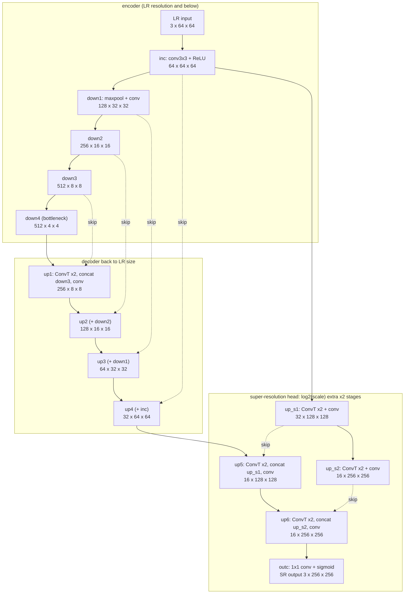
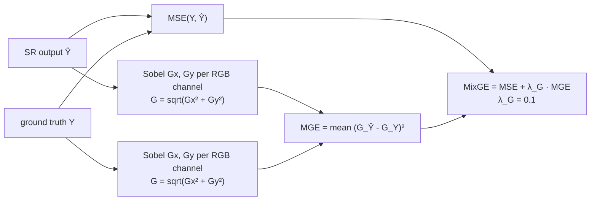
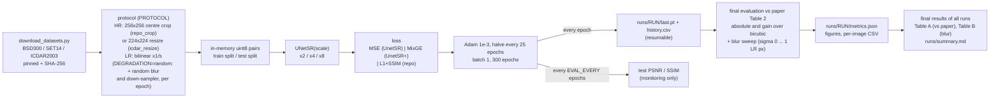
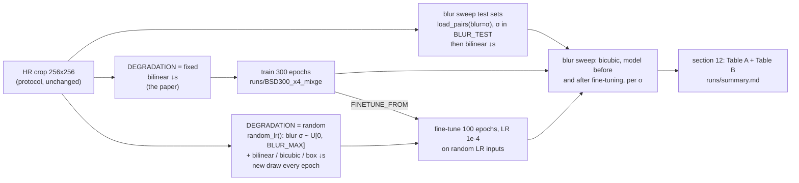

# PBL · Simplified U-Net super-resolution (UnetSR / UnetSR+)

This folder is a reproducible, single-notebook PyTorch re-implementation of

> Z. Lu and Y. Chen, **"Single Image Super Resolution based on a Modified U-net with Mixed Gradient Loss"**,
> arXiv:1911.09428 (2019); journal version in *Signal, Image and Video Processing* 16, 1143–1151 (2022).

It is built on this repository, a fork of the authors' code
[`Mnster00/simplifiedUnetSR`](https://github.com/Mnster00/simplifiedUnetSR) (the paper's footnote links it as
`github.com/MnisterLu/simplifiedUnetSR`).
Everything new lives in `PBL/`; the original code is not modified (only the top-level `README.md` was rewritten as a
guide). **New here? Read §1, then §7 for the results; §10 walks through the code added for the 1 Oct feedback.**

| file | what it is |
|---|---|
| [`SimplifiedUNetSR.ipynb`](SimplifiedUNetSR.ipynb) | **all of the code**: data pipeline, model, losses, metrics, training, evaluation against the paper, figures, inference |
| [`SimplifiedUNetSR.md`](SimplifiedUNetSR.md) | **read this on GitHub**: the notebook with its saved outputs as Markdown, with figures in `SimplifiedUNetSR_files/`. GitHub cannot render the 6 MB notebook itself |
| [`notebook_to_markdown.py`](notebook_to_markdown.py) | regenerates that copy: `uv run python notebook_to_markdown.py` (standard library only) |
| [`download_datasets.py`](download_datasets.py) | downloads BSD300, SET14 and ICDAR2003 into `PBL/data/` (Python standard library only) |
| [`dataset_manifest.json`](dataset_manifest.json) | pinned mirror commits and the SHA-256 of every image, used to verify downloads |
| [`pyproject.toml`](pyproject.toml), [`.python-version`](.python-version) | uv project: Python 3.12, PyTorch as `cpu` / `cu126` / `cu130` extras |
| [`requirements.txt`](requirements.txt) | the same dependencies for `pip` / `uv pip` |
| [`results/bicubic_calibration.csv`](results/bicubic_calibration.csv) | the needs-no-training protocol study behind §5 |
| [`results/set14_subset_search.csv`](results/set14_subset_search.csv) | which Set14 images form the paper's SET14 test set (§3) |
| [`GPU_SESSION.md`](GPU_SESSION.md) | checklist for the first run on a GPU machine: setup, tests and a 30-minute training run |
| [`results/sanity_x8_BSD300_40ep_*`](results/) | the two short training runs of §7.3 (config, per-epoch history, metrics, curves) |
| [`results/gpu_x8_BSD300_300ep_mixge`](results/gpu_x8_BSD300_300ep_mixge/) | the first 300-epoch GPU run (§7.3), with before/after images of three BSD300 test images |
| [`results/ablation_x8_BSD300_15ep_mixge_raw`](results/ablation_x8_BSD300_15ep_mixge_raw/) | the literal-Sobel MixGE run of the §2 ablation |
| [`results/final_results.md`](results/final_results.md) | **the final results (§7)**: Table A, ours vs the paper's Table 2; Table B, robustness to blur |
| [`results/final/`](results/final/) | one folder per final run: config, per-epoch history, metrics, blur sweep, figures |
| [`results/x2_blur_showcase.md`](results/x2_blur_showcase.md) | **×2 on realistic blur**: soft lens, defocus, camera shake and bicubic shrinking, on five test images, before and after fine-tuning |
| [`blur_showcase.py`](blur_showcase.py) | regenerates that page from the two ×2 models in `runs/` (`uv run python blur_showcase.py`, about 3 min) |

**Feedback of 1 Oct 2026 and where it is addressed**

| minute | what changed | where |
|---|---|---|
| 1, 2: compare the **final** results with the paper's model | the whole grid (BSD300 and SET14, ×2/×4/×8, UnetSR and UnetSR+) is trained for 300 epochs and set against the paper's Table 2. The authors published no weights, so their Table 2 is the reference | §7, Table A |
| 3: too much down-sampling loses detail | ×2 and ×4 are trained to the end and are the main results; the notebook measures and shows what ×2 / ×4 / ×8 leave of an image | §7.2; notebook §3b |
| 4a, 4b: training inputs too blurred; randomise the blur to prevent over-fitting | `DEGRADATION="random"`: a new Gaussian blur (σ ≤ 0.5 LR px) and a random down-sampler for every training image in every epoch. On average it is no blurrier than the paper's input | §7.2; notebook §3b |
| 4c: apply the network to images with varied blur | the blur sweep scores every model on the test set blurred by σ = 0 … 1 LR px | §7.2, Table B |
| 5: how others / industry apply blur | the BI, BD, DN, SRMD, BSRGAN and Real-ESRGAN degradations compared | §7.2; notebook §3b |
| 6: fine-tune and prepare results | the 300-epoch UnetSR+ models at ×2 and ×4 are fine-tuned for 100 epochs with random blur (`FINETUNE_FROM`) | §7.2 |

**Contents**
1. [Quick start](#1-quick-start-uv)
2. [The method](#2-the-method)
3. [Datasets](#3-datasets)
4. [Pipeline](#4-pipeline)
5. [Protocol and metrics](#5-pre-processing-and-evaluation-protocol)
6. [Training parameters](#6-training-parameters)
7. [Does it perform like the paper?](#7-does-it-perform-like-the-paper)
8. [Notes on the original code](#8-notes-on-the-original-code)
9. [Troubleshooting](#9-troubleshooting)
10. [Code guide: what was added for the 1 Oct feedback](#10-code-guide-what-was-added-for-the-1-oct-feedback)
11. [Citation](#11-citation)

---

## 1 Quick start (uv)

Install [uv](https://docs.astral.sh/uv/getting-started/installation/), then run this from the repository root (it
works the same in Linux shells and Windows PowerShell):

```bash
cd PBL
uv sync --extra cu130                      # pick ONE extra: cu130 | cu126 | cpu  (table below)
uv run python -c "import torch; print(torch.__version__, torch.cuda.is_available(), torch.backends.mps.is_available())"
uv run python download_datasets.py         # BSD300 + SET14 + ICDAR2003 -> PBL/data/ (ICDAR2003 is plain HTTP: if it fails, see §3)
uv run jupyter lab SimplifiedUNetSR.ipynb  # then: Run > Run All Cells
```

| your hardware | extra | requirement |
|---|---|---|
| NVIDIA Turing → Blackwell: RTX 20xx/30xx/40xx/50xx, A100, H100, B200, … | `cu130` | NVIDIA driver ≥ 580 (Linux 580.65, Windows 580.88); the only choice for RTX 50xx / B200 |
| NVIDIA Maxwell → Volta: GTX 9xx/10xx, Titan X/V, V100; or a Turing → Hopper GPU that must stay on driver 525–579 | `cu126` | driver ≥ 525.60 (Linux) / 528.33 (Windows); has no Blackwell kernels |
| no NVIDIA GPU (Linux, Windows) | `cpu` | none |
| macOS: Apple Silicon (M1 or newer), GPU used via MPS | `cpu` | macOS 14 Sonoma or newer; current PyTorch has no wheels for Intel Macs or macOS 13 |

> **uv does not remember extras.** Pass the same `--extra` to every `uv sync`; a plain `uv sync` removes PyTorch
> again. `uv run` leaves the environment alone. The first `uv sync` writes `uv.lock` (one lock file for all platforms
> and extras); this project does not commit it.

A working NVIDIA setup prints something like `2.14.1+cu130 True False`, an Apple-Silicon Mac `2.14.1 False True`. On
an NVIDIA machine, a `+cpu` version or `False` for CUDA means the wrong build or driver; see [§9](#9-troubleshooting).
Section 2 of the notebook prints a diagnosis and the fix.

**Headless and batch runs** use [papermill](https://papermill.readthedocs.io). Any variable in the notebook's first
code cell can be overridden with `-p NAME value` (booleans as `True` / `False`; `true` / `false` work too). Every
configuration gets its own folder `runs/<RUN_NAME>/`: the default name tags each setting you changed, e.g.
`BSD300_x4_mixge_lg0.01`, so runs never overwrite each other.

```bash
uv run papermill SimplifiedUNetSR.ipynb runs/smoke.ipynb -p SMOKE_TEST True       # checks the pipeline in ~20 s
uv run papermill SimplifiedUNetSR.ipynb runs/BSD300_x4_mixge.ipynb -p SCALE 4 -p LOSS mixge
uv run papermill SimplifiedUNetSR.ipynb runs/calibrate.ipynb -p MODE calibrate    # protocol study, no training
```

When you commit new outputs in the notebook, refresh its GitHub-readable copy too:
`uv run python notebook_to_markdown.py` rewrites `SimplifiedUNetSR.md` and `SimplifiedUNetSR_files/`.

**The pip / requirements.txt route**, if you prefer it:

```bash
uv venv --python 3.12
uv pip install -r requirements.txt --torch-backend=auto    # uv >= 0.9.4 picks the CUDA build for your driver
uv run --no-sync jupyter lab SimplifiedUNetSR.ipynb
```

With plain pip, run `pip install torch --index-url https://download.pytorch.org/whl/cu130` (or `cu126` / `cpu`) first,
then `pip install -r requirements.txt`.

> **What was tested where.** This folder was built in a CPU-only Linux sandbox that could reach GitHub and PyPI only,
> then checked on a GPU machine.
>
> **Verified in the sandbox:** the uv environment (PyPI's torch 2.14.1, a CUDA 13.0 build, running on CPU); the dataset
> download from the pinned GitHub mirrors; the notebook end to end on CPU (×2/×4/×8, all losses, resume, AMP, hold-out,
> `MODE=calibrate`); and the protocol study.
>
> **Verified on a GPU** (Windows 11, NVIDIA GeForce RTX 2070 with Max-Q Design, compute capability 7.5, driver 610.62):
> both setup routes, `uv sync --extra cu130` and `uv pip install -r requirements.txt --torch-backend=auto`, each giving
> torch 2.14.1+cu130; the BSD300 download from the Berkeley HTTPS host; the checklist in
> [`GPU_SESSION.md`](GPU_SESSION.md) (training, resuming finished and interrupted runs from papermill and from a Jupyter
> kernel, the settings check, the float32 fallback for `AMP` on a pre-Ampere GPU, hold-out, cross-dataset scores,
> `MODE=calibrate` reproducing both committed CSVs unchanged, CPU-portable weights); a 300-epoch ×8 run; and the final
> grid of §7, with the random-blur fine-tunes and the blur sweep. On CPU, the paper path gives the same numbers as
> before the degradation code was added (12.2555 dB in the smoke test), and a random-blur run resumed after epoch 2
> ends exactly where an uninterrupted one does.
>
> **Not verified anywhere:** MPS (macOS), CUDA on Linux, the cu126 build, bf16 `AMP` on an Ampere or newer GPU, the
> HuggingFace host, and ICDAR2003, whose plain-HTTP servers timed out (IAPR-TC11) or did not resolve (Essex) on both
> machines. Its download code is covered by fixture-based tests instead.

---

## 2 The method

### Modified U-net (paper §3.1, repo `Unet/Umodel.py`)

The paper changes the original U-net in three ways:

* All batch-norm layers and one of the two convolutions in each block are removed, so every block is a single 3×3
  conv + ReLU.
* The network takes the small LR image and **grows it**. After the usual encoder-decoder returns to the LR size, it
  adds `log2(scale)` extra ×2 stages: 1 for ×2, 2 for ×4, 3 for ×8. Their skip connections come from a chain of ×2
  transposed convolutions (`up_s1, up_s2, …`) applied to the first feature map.
* Depth 5 is the accuracy/cost trade-off the paper picks (Fig. 3).

The diagram shows the ×4 model with tensor sizes for a 64×64 input (`repo_crop` protocol):



| model | repo class | decoder up-sampling | extra ×2 stages | output | parameters |
|---|---|---|---|---|---|
| ×2 | `UNet2` | transposed conv 2×2 | 1 (width 32) | 1×1 conv, no activation | **8,495,907** (paper: 8.50 M) |
| ×4 | `UNet4` | transposed conv 2×2 | 2 (16, 16) | 1×1 conv + sigmoid | 8,501,043 |
| ×8 | `UNet8` | bilinear, `align_corners=True` | 3 (16, 8, 8) | 1×1 conv + sigmoid | 7,103,299 |

The notebook's `UNetSR(scale)` keeps the repository's module names. The original `UNet2/4/8` weights therefore load
with `strict=True` and give **bit-identical outputs**, which the notebook checks every time it runs.

### Mixed gradient error (paper §3.2)



* **UnetSR** is the modified U-net trained with MSE.
* **UnetSR+** is the same network trained with MixGE.
* The Sobel kernels are Gx = [[-1,-2,-1],[0,0,0],[1,2,1]] and Gy = [[-1,0,1],[-2,0,2],[-1,0,1]] (eqs. 2–3).
* λ<sub>G</sub> = 0.1 is the best value in the paper's sweep over 1e-4 … 1 (Fig. 4).

**One ambiguity matters a lot: how big the MGE term is.** The paper prints raw Sobel kernels and λ<sub>G</sub> = 0.1,
but also describes MSE as the *main* component and MGE as an *auxiliary* one. On the bicubic outputs of the 100
BSD300 test images, the two readings give:

* **raw kernels, taken literally**: 0.1·MGE is **2.5–3× the MSE**;
* **kernels ÷ 8**, the usual normalisation under which a ramp of slope 1 has a gradient of 1: 0.1·MGE is
  **0.04–0.05× the MSE**, an auxiliary term.

The notebook prints this ratio for your own run (section 7). The authors' unused `Unet/GraLoss.py` also scales its
gradient terms down, dividing them by 100 and 10 000. On the same images it comes to 0.3–0.4× the MSE, between the
two readings, so it does not decide the question.

A short ablation (×8, BSD300, 15 epochs, the same seed, CPU) decides it:

| loss | test PSNR / SSIM after 15 epochs | from |
|---|---|---|
| MSE | 21.17 dB / 0.510 | epoch 15 of [`results/sanity_x8_BSD300_40ep_mse`](results/sanity_x8_BSD300_40ep_mse/history.csv) |
| MixGE, raw Sobel kernels (literal, `SOBEL_NORM=False`) | 20.76 dB / 0.461 | [`results/ablation_x8_BSD300_15ep_mixge_raw`](results/ablation_x8_BSD300_15ep_mixge_raw/metrics.json) |
| **MixGE, Sobel ÷ 8 (default)** | **21.45 dB / 0.513** | epoch 15 of [`results/sanity_x8_BSD300_40ep_mixge`](results/sanity_x8_BSD300_40ep_mixge/history.csv) |
| (bicubic) | 21.34 dB / 0.495 | |

Only the normalised version reproduces the paper's finding that MixGE beats MSE (its Fig. 4). The notebook therefore
uses `SOBEL_NORM=True`; set `SOBEL_NORM=False` for the literal formula. On one CPU, training is deterministic: a
15-epoch run retraces the first 15 epochs of a 40-epoch run exactly.

Three smaller details the paper leaves open are fixed as follows:

* the Sobel filter runs on every RGB channel;
* valid convolution, i.e. no padding;
* ε = 1e-6 inside the square root, so gradients stay finite on flat regions.

---

## 3 Datasets

| dataset | content | split used here | paper |
|---|---|---|---|
| **BSD300** (BSDS300, Martin et al. 2001) | 300 natural photos, 481×321 | train 200 / test 100 (official split) | not stated; the bicubic match (§5) implies the official split |
| **SET14** (Zeyde et al. 2010) | 14 classic test images | train 11 / **test 3: comic, monarch, zebra** | not stated; inferred, see below |
| **ICDAR2003** Robust Reading (Lucas et al. 2003) | scene-text photos, 422×102 … 640×480 (paper §4.1) | train 258 / test 251 (official TrialTrain / TrialTest) | 258 / 249 |

**Why SET14 is split 11 / 3.** The paper never says how it used SET14. The repository's data code expects
`<dataset>/images/{train,test}` for *every* dataset, and its comments list `SET14/images`. The decisive evidence:
**the paper's SET14 bicubic numbers are reproduced to all four decimals, in PSNR and SSIM at ×2, ×4 and ×8, if and
only if the test set is `comic`, `monarch` and `zebra`.** `MODE=calibrate` checks all 16,383 subsets of the 14
images; the next best one, comic + zebra, is 0.35 dB / 0.052 SSIM off
([`results/set14_subset_search.csv`](results/set14_subset_search.csv)).
Which images the authors trained their SET14 models on is not known; the notebook assumes the other 11.

To score a model trained on another dataset (e.g. BSD300) on all 14 images, as most SR papers do, add `"SET14_ALL"` to
`EVAL_SETS`. For a SET14-trained model, SET14_ALL would include its 11 training images; the notebook warns about that.
`VAL_HOLDOUT = 50` sets aside 50 seeded training images as an extra test set `<DATASET>_VAL`, as the paper did for its
depth and λ<sub>G</sub> studies (§4.4.1); the files in `data/` are not touched.

### `download_datasets.py`

```bash
uv run python download_datasets.py                        # all three datasets
uv run python download_datasets.py --datasets bsd300 set14
uv run python download_datasets.py --verify-only          # re-count and re-hash what is in data/
uv run python download_datasets.py --list-sources         # show the source URLs, in the order they are tried
```

It needs only the Python standard library, so it also runs before `uv sync`. The notebook calls it automatically for
missing datasets. The resulting layout:

```
PBL/data/
├── BSD300/{train,test}/*.jpg        200 / 100
├── SET14/{train,test}/*.png         11 / 3
├── ICDAR2003/{train,test}/*.jpg     258 / 251
└── PROVENANCE.json                  source, URL, time, checksums and licence note per dataset
```

| dataset | sources, tried in order | verification |
|---|---|---|
| BSD300 | 1. Berkeley `BSDS300-images.tgz` (HTTPS, then HTTP) · 2. GitHub mirror `BUPTLdy/pytorch-lapsrn` @ `6948718` | SHA-256 of all 300 images + the official iids split lists |
| SET14 | 1. GitHub mirror `jbhuang0604/SelfExSR` @ `8f6dd8c` (`image_SRF_2` HR images) · 2. HuggingFace `eugenesiow/Set14` | SHA-256 of all 14 images (mirror) |
| ICDAR2003 | 1. IAPR-TC11 `TrialTrain/scene.zip`, `TrialTest/scene.zip` · 2. Essex `algoval` copy | SHA-256 of both zips (the values docTR uses) |

Notes:

* The GitHub mirrors are pinned to a commit, and every file is hash-checked.
* The SelfExSR copies of comic, ppt3 and zebra have at most one pixel row or column trimmed so that sizes are even.
  These exact files reproduce the paper's SET14 bicubic row to the fourth decimal.
* **ICDAR2003 is only served over plain HTTP.** If your network blocks that, download the two zips by hand. Both are
  called `scene.zip`, so save `TrialTrain/scene.zip` as `PBL/data/.downloads/icdar2003_train.zip` and
  `TrialTest/scene.zip` as `PBL/data/.downloads/icdar2003_test.zip`, then re-run the script. When the download fails,
  the script prints both URLs with these target paths and their SHA-256; `--list-sources` shows them too. (With
  another `--root` or `DATA_DIR`, use its `.downloads/` folder.)
* The same works for the other datasets: `.downloads/BSDS300-images.tgz` and `.downloads/Set14_HR.tar.gz` are used
  before any download is tried.
* **Licences.**
  * BSDS300 is free for non-commercial research and education.
  * Set14 and ICDAR2003 are research benchmarks.
  * Nothing from the datasets is committed to this repository.

---

## 4 Pipeline



---

## 5 Pre-processing and evaluation protocol

### The paper's text versus what reproduces its numbers

The paper's text (§4.3, Table 1) says every image is resized to 224×224 and downscaled with **bicubic** interpolation.
The bicubic baseline needs no training, so it is a direct test of that claim: under the same preparation, it must
reproduce the paper's "Bicubic" rows. Running the notebook with `MODE=calibrate` tries 8 variants on every available
dataset (`results/bicubic_calibration.csv`):

| protocol (notebook name) | HR ground truth | LR input | SET14 (3 test images) Δ vs paper, ×2 / ×4 / ×8 | BSD300 Δ vs paper, ×2 / ×4 / ×8 |
|---|---|---|---|---|
| **`repo_crop`** (PyTorch SR example) | central 256×256 crop, zero-padded if smaller | **bilinear** ↓s | **+0.0000 / −0.0000 / −0.0000 dB**, SSIM ±0.0000 | **+0.028 / +0.035 / +0.030 dB**, SSIM +0.001…0.002 |
| `icdar_resize` | whole photo → 224×224 bicubic | bilinear ↓s | −0.89 / −0.17 / +1.31 dB | +0.72 / +0.55 / +0.37 dB |
| `paper_text` (as written) | whole photo → 224×224 bicubic | **bicubic** ↓s | +0.36 / +0.25 / +1.52 dB | +1.63 / +0.98 / +0.68 dB |

**Conclusion.** The paper's BSD300 and SET14 numbers come from the pipeline of the PyTorch super-resolution example
that the repository's `dataset/data.py` is derived from: `CenterCrop(256)`, then `Resize(256//s)`, whose default filter
is bilinear. (The committed `data.py` has the `CenterCrop` lines commented out, see §8.) The numbers do not come from
the 224-pixel bicubic resize described in the text, which probably refers only to how the ICDAR2003 photos were
prepared (§4.1).

The notebook therefore defaults to `PROTOCOL="repo_crop"` for BSD300 and SET14. For ICDAR2003 it uses
`icdar_resize`: a 224×224 bicubic resize as in §4.1, plus the loader's bilinear LR. With `PROTOCOL="auto"` (the
default) every dataset, including extra test sets in `EVAL_SETS`, gets its own protocol. ICDAR2003 could not be downloaded
in the build sandbox, so that choice is **unverified**. Running `-p MODE calibrate` once the data is present shows
which variant reproduces the paper's ICDAR2003 bicubic row.

### Metrics (paper §4.2)

* **PSNR** = 10·log10(255²/MSE) on the RGB image (equivalently 10·log10(1/MSE) on [0,1] tensors), computed per image
  and then averaged over the test set.
* **SSIM** uses an 11×11 Gaussian window with σ = 1.5 and zero "same" padding, averaged over the channels. It is
  identical (|Δ| = 0) to the repository's `pytorch_ssim`; the notebook asserts this.
* Model outputs are **not** clamped before scoring, as in the repo. Only the ×2 model has an unbounded output.
* For reference, `metrics.json` also has the usual literature metrics: Y channel (BT.601), 8-bit, `scale` border
  pixels shaved, valid-window SSIM. These are *not* comparable with the paper.

---

## 6 Training parameters

| | paper (text) | repository code | **notebook default** |
|---|---|---|---|
| training data | not stated (one model per dataset is implied) | `<dataset>/images/train` | `DATASET` = BSD300 (or SET14, ICDAR2003); one model per dataset |
| HR / LR | 224×224, bicubic (Table 1) | `Resize(256)` / `Resize(256//s)` of the whole photo (`CenterCrop` commented out, §8) | `repo_crop`; `icdar_resize` for ICDAR2003 (§5) |
| batch size | 1 | 1 | 1 |
| optimiser | Adam β=(0.9, 0.999), ε=1e-8 | Adam, weight decay 1e-6 | Adam β=(0.9, 0.999), ε=1e-8, wd 1e-6 |
| learning rate | 1e-3, halved every 25 epochs | 1e-3 (`argdemo.txt`); MultiStepLR at 50/100/150/200 | 1e-3, `StepLR(25, 0.5)` |
| epochs | not stated | `-n 300` in the README example | 300 |
| loss | MSE (UnetSR), MixGE with λ<sub>G</sub> = 0.1 (UnetSR+) | L1 + 0.1·(1 − SSIM) | `LOSS="mixge"` (`"mse"`, `"l1_ssim"`) |
| Sobel scale in MGE | raw ±1/±2 kernels printed; MGE described as "auxiliary" | `GraLoss` divides by 100 and 10 000 (unused) | kernels ÷ 8 (`SOBEL_NORM=True`), see §2 |
| initialisation | not stated | PyTorch default (`weight_init` is a no-op) | PyTorch default |
| augmentation | not stated | none | none (`AUGMENT=True` optional) |
| degradation (LR from HR) | one fixed down-scaling | one fixed down-scaling | fixed (`DEGRADATION="fixed"`); for the robustness study, `"random"`: Gaussian blur σ ~ U[0, 0.5] LR px and a random bilinear / bicubic / box down-sampler per image and epoch (§7.2) |
| fine-tuning | – | – | none; `FINETUNE_FROM=<run>` starts from another run's weights (§7.2: LR 1e-4, 100 epochs) |
| hold-out set | 50 random training images, for the depth and λ<sub>G</sub> studies (§4.4.1) | none | none (`VAL_HOLDOUT=50` optional) |
| seed | not stated | 123 (set *after* the model is built) | 123, set *before* the model is built |
| model selection | not stated | last epoch | last epoch (test monitoring every `EVAL_EVERY` epochs) |
| run folder | – | – | `runs/<RUN_NAME>/`, one per configuration; resuming checks every training setting |
| hardware | 1× RTX 2080, PyTorch | PyTorch 1.x (2019) | any CUDA GPU, MPS or CPU; optional bf16 `AMP` |

---

## 7 Does it perform like the paper?

**Short answer.** The final grid trains every model for 300 epochs, one run each, on an RTX 2070 Max-Q. The full tables
are in [`results/final_results.md`](results/final_results.md).

* **BSD300 is the reliable comparison**: 100 test images, and a protocol reproduced to 0.035 dB.
  * ×8 matches the paper for both models (+0.04 and +0.01 dB).
  * At ×4 and ×2 our models are 0.25–0.78 dB below the paper: "matches" for UnetSR at ×4, "close" for the other three.
* **MixGE does not help here.** At every scale, UnetSR+ and UnetSR end within 0.03 dB of each other. The paper reports
  UnetSR+ ahead by +0.42 / +0.12 / +0.05 dB at ×2 / ×4 / ×8. Most of our shortfall at ×2 and ×4 is that missing
  MixGE gain.
* **SET14: the paper's models were not trained on 11 images.**
  * Trained on the 11 other Set14 images, our models stay at or below bicubic. At batch size 1 and 300 epochs, that is
    only 3,300 updates.
  * The BSD300-trained models, scored on the same 3 test images, reach or beat the paper's SET14 numbers at ×2 and ×4,
    e.g. 28.92 dB against 28.40 for UnetSR+ at ×2.
* **Training longer would not close the gaps.** Every run's test PSNR rose by less than 0.01 dB after epoch 200, and
  none over-fits the clean test set: each one peaks at its last epoch.
* **Blur (minutes 3–6 of the 1 Oct meeting, §7.2).**
  * The paper-protocol models lose most of their advantage over bicubic as the input gets blurrier.
  * Fine-tuning with random blur wins back part of it at ×2: +0.2 to +0.3 dB on blurred inputs, at a cost of 0.15 dB on
    the paper's test set.
  * At ×4 the effect stays within 0.1 dB.

| check | result | evidence |
|---|---|---|
| architecture = authors' code | ✅ identical outputs to `UNet2/4/8` with the same weights (max \|Δ\| = 0) | notebook §4 |
| parameter count | ✅ 8,495,907 (×2) = paper's **8.50 M** (Table 3, Fig. 3) | notebook §4 |
| metric implementation | ✅ SSIM identical to the repo's `pytorch_ssim` (\|Δ\| = 0) | notebook §5 |
| data protocol (bicubic rows of Table 2) | ✅ SET14 **exact** at ×2/×4/×8; BSD300 within **0.035 dB / 0.0021 SSIM**; ⚠️ ICDAR2003 unverified | `results/bicubic_calibration.csv` |
| pipeline runs end to end | ✅ ×2/×4/×8 × {mse, mixge, l1_ssim}, AMP, augmentation, resume (≤ 1e-8 from an uninterrupted run, also with random blur), SET14/ICDAR paths; on CPU and on an NVIDIA GPU (`GPU_SESSION.md` T1–T15) | papermill smoke tests |
| final results, BSD300 (300 epochs) | ✅ ×8 matches (both models); ×4 UnetSR matches; ×4 UnetSR+ and ×2 close (−0.38 to −0.78 dB) | Table A |
| final results, SET14 | ⚠️ trained on its 11 other images: well below the paper. Trained on BSD300: at or above it at ×2/×4 | Table A |
| robustness to blur, random-blur fine-tuning | ✅ the sweep shows the fixed-degradation weakness; fine-tuning helps at ×2, barely at ×4 | Table B |
| ICDAR2003 | ⏳ not run: its plain-HTTP servers could not be reached | §3 |

### 7.1 Final results vs the paper (Table A)

PSNR [dB] / SSIM on RGB, with the paper's protocol (§5), at the last epoch of a single 300-epoch run. Δ = ours − paper,
with the verdict below. The column "BSD300-trained" scores the BSD300 models on the SET14 test images, which the
paper does not do.

| dataset | scale | bicubic paper | bicubic ours | UnetSR paper | UnetSR ours | UnetSR Δ dB | UnetSR+ paper | UnetSR+ ours | UnetSR+ Δ dB | UnetSR / UnetSR+ ours, BSD300-trained | best other method (paper) |
|---|---|---|---|---|---|---|---|---|---|---|---|
| BSD300 | x2 | 26.65 / 0.7924 | 26.68 / 0.7938 | 29.42 / 0.8813 | 29.04 / 0.8726 (300 ep) | -0.38 (close) | 29.84 / 0.8816 | 29.06 / 0.8735 (300 ep) | -0.78 (close) | - | DBPN 29.87 / 0.8834 |
| BSD300 | x4 | 23.51 / 0.6157 | 23.54 / 0.6178 | 24.83 / 0.6843 | 24.58 / 0.6755 (300 ep) | -0.25 (matches) | 24.95 / 0.6901 | 24.55 / 0.6753 (300 ep) | -0.40 (close) | - | DBPN 25.06 / 0.6967 |
| BSD300 | x8 | 21.31 / 0.4933 | 21.34 / 0.4951 | 21.99 / 0.5231 | 22.03 / 0.5255 (300 ep) | +0.04 (matches) | 22.04 / 0.5235 | 22.04 / 0.5263 (300 ep) | +0.01 (matches) | - | DBPN 22.06 / 0.5229 |
| SET14 | x2 | 24.45 / 0.8482 | 24.45 / 0.8482 | 26.72 / 0.8735 | 24.51 / 0.8441 (300 ep) | -2.21 (differs) | 28.40 / 0.9198 | 24.43 / 0.8413 (300 ep) | -3.96 (differs) | 28.84 / 28.92 | VDSR 28.66 / 0.9269 |
| SET14 | x4 | 19.72 / 0.6089 | 19.72 / 0.6089 | 20.89 / 0.6693 | 18.55 / 0.5826 (300 ep) | -2.34 (differs) | 21.68 / 0.7112 | 18.57 / 0.5819 (300 ep) | -3.11 (differs) | 21.96 / 21.87 | DBPN 21.77 / 0.7171 |
| SET14 | x8 | 16.11 / 0.3673 | 16.11 / 0.3673 | 16.70 / 0.4093 | 16.23 / 0.3727 (300 ep) | -0.47 (close) | 17.83 / 0.4103 | 16.08 / 0.3689 (300 ep) | -1.75 (differs) | 17.10 / 17.12 | VDSR 16.80 / 0.4095 |

Each run writes `runs/<name>/metrics.json` with the difference to the paper, in absolute terms and as **gain over
bicubic** against the paper's gain. Every comparison with the matching paper row gets a verdict, with thresholds fixed
in advance. Test sets of other datasets, `SET14_ALL` and the hold-out set are scored, but get no verdict.

* **matches**: |ΔPSNR| ≤ 0.3 dB and |ΔSSIM| ≤ 0.01;
* **close**: |ΔPSNR| ≤ 1 dB;
* **differs**: anything else.

Section 12 of the notebook collects the final runs into `runs/summary.md` (Tables A and B). The notebook also holds all
33 rows of the paper's Table 2, including the ICDAR2003 targets and the eight baselines.

**What to keep in mind when you compare:**

* **BSD300 is the most reliable comparison.** The protocol is reproduced to 0.035 dB, and it has 100 test images.
* **These are single runs.** On the GPU, two runs with the same seed differed by about 0.1 dB after 40 epochs. That is
  as large as the UnetSR → UnetSR+ gain the paper reports at ×4 and ×8.
* **SET14 numbers are very noisy.** By our analysis they are means over only **3 test images**. Some of the paper's own
  baselines (EDSR, FSRCNN, SRGAN at ×2) score *below* bicubic there. The paper does not say what its SET14 models were
  trained on; the BSD300-trained column suggests a set much larger than 11 images.
* **For ICDAR2003, check the protocol first.** Run `MODE=calibrate` when the data is there: the protocol is
  unverified, and the official test set has 251 images against the paper's 249.
* **The paper leaves several things unstated**: the number of epochs (300 is the repo's example), the random seed, how
  the baselines were trained, and whether its results come from single runs.

### 7.2 Blur, randomised degradation and fine-tuning (meeting of 1 Oct, minutes 3–6)

**Every down-scaling already blurs.** Pillow's bilinear filter is anti-aliased. At ×s it acts much like a Gaussian
blur of σ ≈ 0.41·s HR pixels: 0.8 at ×2, 1.6 at ×4, 3.3 at ×8. A ×8 input keeps 1/64 of the pixels, and what it has
lost is hard to recover, so ×2 and ×4 are the main results. The paper trains with this one fixed degradation, so its
networks learn to undo exactly that blur and nothing else.

**How others degrade images.** SR papers write the LR image as y = (x ⊗ k)↓s + n: the HR image x is blurred by a
kernel k, down-sampled by s and, optionally, gets noise n.

| setting | blur kernel k | down-sampler | noise, compression |
|---|---|---|---|
| **BI** (standard benchmarks: Set5, Set14, B100, Urban100, Manga109) | none beyond the resize filter | MATLAB `imresize`, bicubic | – |
| **BD** ([RDN](https://arxiv.org/abs/1802.08797), CVPR 2018) | 7×7 Gaussian, σ = 1.6 HR px | ×3 | – |
| **DN** (RDN) | – | bicubic ×3 | Gaussian, level 30 |
| **[SRMD](https://arxiv.org/abs/1712.06116)** (CVPR 2018) | isotropic Gaussian, width in [0.2, 2] / [0.2, 3] / [0.2, 4] HR px at ×2 / ×3 / ×4, plus anisotropic kernels | bicubic | Gaussian |
| **[BSRGAN](https://arxiv.org/abs/2103.14006)** (ICCV 2021) | isotropic and anisotropic Gaussian, applied twice | nearest, bilinear or bicubic | Gaussian, JPEG, camera-sensor noise; the order is shuffled at random |
| **[Real-ESRGAN](https://arxiv.org/abs/2107.10833)** (ICCVW 2021) | Gaussian, generalised-Gaussian or plateau kernels of 7–21 px, σ ∈ [0.2, 3], then [0.2, 1.5]; sinc filters | area, bilinear or bicubic | Gaussian or Poisson noise, JPEG quality 30–95; the whole chain is applied twice |

The common idea: draw a new degradation for every training sample, so that the network cannot over-fit to one
kernel.

**What the notebook does** (`DEGRADATION="random"`, notebook §3b), in the spirit of SRMD but milder, as the meeting
asked:

* In every epoch, every training image gets an isotropic Gaussian blur with σ drawn uniformly from [0, 0.5] LR pixels.
* It is then down-scaled by a random filter: bilinear, bicubic or box.
* Noise and JPEG are left out.

The table shows why 0.5 LR px. It gives the PSNR of the bicubic-upscaled LR input against the ground truth, as a mean
over 40 BSD300 training images; lower means more detail lost.

| input | ×2 | ×4 | ×8 |
|---|---|---|---|
| paper input (bilinear, σ = 0) | 26.83 | 23.61 | 21.43 |
| + blur 0.25 LR px | 26.45 | 23.34 | 21.23 |
| **+ blur 0.5 LR px** (the maximum used) | **25.35** | **22.69** | **20.72** |
| + blur 1.0 LR px (SRMD's range) | 23.52 | 21.38 | 19.62 |
| bicubic or box filter instead of bilinear, σ = 0 | 27.7–27.9 | 24.0 | 21.7 |

* At 1 LR px, a ×4 input is as poor as the paper's ×8 input: 21.38 against 21.43 dB.
* At 0.5 LR px the worst case is 0.9 dB (×4) or 1.5 dB (×2) below the paper's input.
* Because bicubic and box are sharper than bilinear, the training mix as a whole is about as blurred as the paper's
  input. It varies the blur rather than adding more of it.

[`degradation_preview.png`](results/final/degradation_preview.png) shows the inputs.

**Fine-tuning.** The 300-epoch UnetSR+ models at ×2 and ×4 were fine-tuned with random blur for 100 epochs, at a
learning rate of 1e-4 halved every 25 epochs (`FINETUNE_FROM`). Every final model was then scored on the **blur
sweep**: the BSD300 test split, blurred by σ = 0 … 1 LR px before the down-scaling. σ = 0 is the paper's test set;
0.75 and 1.0 lie beyond the training range.

**Table B: PSNR [dB] on the blur sweep** (σ in LR pixels):

| dataset | scale | model | run | σ=0 | σ=0.25 | σ=0.5 | σ=0.75 | σ=1 |
|---|---|---|---|---|---|---|---|---|
| BSD300 | x2 | bicubic | - | 26.68 | 26.31 | 25.25 | 24.26 | 23.45 |
| BSD300 | x2 | UnetSR, fixed degradation | BSD300_x2_mse | 29.04 | 28.80 | 26.85 | 25.01 | 23.82 |
| BSD300 | x2 | UnetSR+, fixed degradation | BSD300_x2_mixge | 29.06 | 28.82 | 26.87 | 25.03 | 23.83 |
| BSD300 | x2 | UnetSR+, random blur, fine-tuned | BSD300_x2_mixge_rand_ft_lr0.0001 | 28.90 | 28.68 | 27.11 | 25.31 | 24.01 |
| BSD300 | x4 | bicubic | - | 23.54 | 23.27 | 22.62 | 21.91 | 21.29 |
| BSD300 | x4 | UnetSR, fixed degradation | BSD300_x4_mse | 24.58 | 24.43 | 23.52 | 22.41 | 21.56 |
| BSD300 | x4 | UnetSR+, fixed degradation | BSD300_x4_mixge | 24.55 | 24.42 | 23.53 | 22.43 | 21.57 |
| BSD300 | x4 | UnetSR+, random blur, fine-tuned | BSD300_x4_mixge_rand_ft_lr0.0001 | 24.55 | 24.40 | 23.60 | 22.52 | 21.63 |
| BSD300 | x8 | bicubic | - | 21.34 | 21.13 | 20.60 | 20.00 | 19.45 |
| BSD300 | x8 | UnetSR, fixed degradation | BSD300_x8_mse | 22.03 | 21.92 | 21.24 | 20.37 | 19.66 |
| BSD300 | x8 | UnetSR+, fixed degradation | BSD300_x8_mixge_300ep_gpu | 22.04 | 21.95 | 21.28 | 20.40 | 19.68 |
| SET14 | x2 | bicubic | - | 24.45 | 23.89 | 22.29 | 20.75 | 19.48 |
| SET14 | x2 | UnetSR, fixed degradation | SET14_x2_mse | 24.51 | 24.23 | 23.01 | 21.42 | 19.96 |
| SET14 | x2 | UnetSR+, fixed degradation | SET14_x2_mixge | 24.43 | 24.17 | 22.99 | 21.45 | 20.02 |
| SET14 | x4 | bicubic | - | 19.72 | 19.25 | 18.17 | 17.04 | 16.12 |
| SET14 | x4 | UnetSR, fixed degradation | SET14_x4_mse | 18.55 | 18.36 | 17.73 | 16.79 | 15.88 |
| SET14 | x4 | UnetSR+, fixed degradation | SET14_x4_mixge | 18.57 | 18.38 | 17.75 | 16.81 | 15.90 |
| SET14 | x8 | bicubic | - | 16.11 | 15.84 | 15.22 | 14.59 | 14.12 |
| SET14 | x8 | UnetSR, fixed degradation | SET14_x8_mse | 16.23 | 16.08 | 15.52 | 14.81 | 14.23 |
| SET14 | x8 | UnetSR+, fixed degradation | SET14_x8_mixge | 16.08 | 15.92 | 15.36 | 14.67 | 14.11 |

* **The fixed-degradation models over-fit to their one degradation.**
  * As the blur grows, their gain over bicubic shrinks: UnetSR+ goes from +2.38 to +0.38 dB at ×2, +1.01 to +0.28 dB
    at ×4, and +0.70 to +0.23 dB at ×8, between σ = 0 and σ = 1.
  * UnetSR behaves the same.
* **×2, fine-tuned:**
  * vs the model it started from: +0.24 / +0.28 / +0.18 dB at σ = 0.5 / 0.75 / 1.0, and −0.15 dB on the paper's
    test set;
  * a likely cause of the clean-test cost (not tested): the bicubic and box filters in the training mix are sharper
    than the test's bilinear, so the model now hedges between them.
* **×4, fine-tuned:** within 0.1 dB of the model it started from everywhere: −0.01 dB at σ = 0 and 0.25, +0.07 / +0.09 / +0.06 dB
  at σ = 0.5 / 0.75 / 1.0. At a learning rate of 1e-4 the ×4 model hardly moves. It also has less to work with: a
  ×4 input carries a quarter of the pixels of a ×2 input.
* **Next experiments.** A stronger fine-tune (a higher learning rate) or 300 epochs of random blur from scratch
  (notebook §13).
* **Figures:**
  * [`summary_blur.png`](results/final/summary_blur.png) plots every curve;
  * [`blur_examples.png`](results/final/BSD300_x4_mixge_rand_ft_lr0.0001/figures/blur_examples.png) shows one test
    image at σ = 0, 0.5 and 1.0, before and after fine-tuning;
  * [`x2_blur_showcase.md`](results/x2_blur_showcase.md) tries the ×2 models on blur closer to real photos: soft
    lens, defocus, camera shake and bicubic shrinking. Fine-tuning helps with all round blurs, but not with camera
    shake.

### 7.3 How the results developed

* **40 epochs, ×8, CPU.** UnetSR+ reached 21.746 dB / 0.5201 and UnetSR 21.742 / 0.5195 (bicubic 21.342), both
  "matches". The runs are in [`results/sanity_x8_BSD300_40ep_*`](results/), and the same commands on the RTX 2070 gave
  21.837 and 21.814.
* **300 epochs, ×8 UnetSR+, GPU.** 22.043 dB / 0.5263 in 16.5 min. The test PSNR rose fast and then flattened as the
  learning rate kept halving: 21.75 dB at epoch 40, 22.00 at 100, 22.03 at 150, 22.043 at 300
  ([`results/gpu_x8_BSD300_300ep_mixge`](results/gpu_x8_BSD300_300ep_mixge/), with before/after images of three
  BSD300 test images).
* **The final grid** (§7.1) took about 2 h on the same GPU:
  * 15–18 min of training per BSD300 model at every scale;
  * under a minute per SET14 model;
  * 6–7 min per 100-epoch fine-tune. Each run's config, history, metrics, blur sweep and curves are in
  [`results/final/`](results/final/).

### 7.4 Re-running the final grid

From `PBL/`, about 2 h on an RTX 2070. The ×8 UnetSR+ model of the final grid is in `runs/BSD300_x8_mixge_300ep_gpu`;
the loop below trains the same configuration as `runs/BSD300_x8_mixge`.

```bash
# bash / zsh (Linux, macOS, WSL)
for s in 2 4 8; do for l in mse mixge; do
  uv run papermill SimplifiedUNetSR.ipynb runs/BSD300_x${s}_${l}.ipynb -p SCALE $s -p LOSS $l -p EVAL_SETS "BSD300,SET14" -p EVAL_EVERY 10
  uv run papermill SimplifiedUNetSR.ipynb runs/SET14_x${s}_${l}.ipynb -p DATASET SET14 -p SCALE $s -p LOSS $l -p EVAL_EVERY 10
done; done
for s in 2 4; do
  uv run papermill SimplifiedUNetSR.ipynb runs/BSD300_x${s}_ft.ipynb -p SCALE $s -p LOSS mixge -p DEGRADATION random \
    -p FINETUNE_FROM BSD300_x${s}_mixge -p LR 1e-4 -p EPOCHS 100 -p EVAL_EVERY 5
done
```

```powershell
# Windows PowerShell
foreach ($s in 2,4,8) { foreach ($l in 'mse','mixge') {
  uv run papermill SimplifiedUNetSR.ipynb "runs/BSD300_x${s}_${l}.ipynb" -p SCALE $s -p LOSS $l -p EVAL_SETS "BSD300,SET14" -p EVAL_EVERY 10
  uv run papermill SimplifiedUNetSR.ipynb "runs/SET14_x${s}_${l}.ipynb" -p DATASET SET14 -p SCALE $s -p LOSS $l -p EVAL_EVERY 10 } }
foreach ($s in 2,4) {
  uv run papermill SimplifiedUNetSR.ipynb "runs/BSD300_x${s}_ft.ipynb" -p SCALE $s -p LOSS mixge -p DEGRADATION random `
    -p FINETUNE_FROM "BSD300_x${s}_mixge" -p LR 1e-4 -p EPOCHS 100 -p EVAL_EVERY 5 }
```

On the GPU, the notebook prints an ETA after the first epoch. ICDAR2003 runs the same way with `-p DATASET ICDAR2003`
once it is downloaded (§3).

---

## 8 Notes on the original code

The repository is a 2019 fork of [`icpm/super-resolution`](https://github.com/icpm/super-resolution) with the authors'
`Unet/` package added. It does not run as published. Here is what the notebook does about each problem:

| issue in the original code | effect | notebook |
|---|---|---|
| the dataset folder `dataset/output2/images/{train,test}` was never published, and there is no download code | the code cannot run | `download_datasets.py` with a documented layout |
| `CenterCrop` is commented out in `dataset/data.py` | non-square photos give mismatched SR/HR shapes and crash | explicit, named protocols (§5) |
| `UNet.weight_init()` loops over the top-level blocks only | the conv layers keep PyTorch's default init | the same default init, documented |
| `Unet/solver.py` optimises L1 + 0.1·(1−SSIM) | not the paper's MSE / MixGE | all three losses available; MixGE is the default |
| `Unet/GraLoss.py` applies the 2nd Sobel to the *output* of the 1st, pads by 2, and uses arbitrary /100, /10000 scaling; it is computed but never used | not the paper's MGE | paper eqs. (2)–(6), with the Sobel kernels ÷ 8 by default (see §2) |
| `torch.manual_seed` is called *after* the model is built; `listdir` order is unsorted | runs are not reproducible | seed before the model, sorted file lists, resumable checkpoints |
| `scheduler.step(epoch)` (deprecated) with MultiStepLR 50/100/150/200 | differs from the paper's "halve every 25 epochs" | `StepLR(25, 0.5)` as in the paper |
| `torch.save(model)` pickles the whole module; `Unet/output.py` is broken (`self` at module level) | the checkpoints are not portable | `state_dict` checkpoints, safe with `weights_only=True` |
| the README lists `-t` / `-seed` flags that `main.py` does not define | misleading | not used |

---

## 9 Troubleshooting

| symptom | fix |
|---|---|
| `torch.__version__` ends in `+cpu` on a GPU machine (Windows PyPI wheels are CPU-only) | `uv sync --extra cu130`, or `cu126` for GTX 9xx/10xx / V100 |
| `torch.cuda.is_available()` is False with a `+cu130` build | your driver is older than 580: update it (required for RTX 50xx / Blackwell), or use `--extra cu126` on an older GPU |
| "no kernel image is available" / "sm_61 is not compatible" | a pre-Turing GPU on the cu130 build: use `--extra cu126`, the build family that still ships Maxwell–Volta kernels |
| "no kernel image is available" on an RTX 50xx / B200 (Blackwell) | the cu126 build has no Blackwell kernels: update the driver to ≥ 580 and use `--extra cu130` |
| macOS: `uv sync` reports that torch has no wheel for your platform | current PyTorch needs Apple Silicon and macOS 14 or newer; on an Intel Mac use Linux, Windows or a cloud notebook |
| `uv run` keeps re-installing / torch disappears | always pass the same `--extra` to `uv sync`; do not run a bare `uv sync` |
| `--torch-backend` errors / no `cu130` choice | `uv self update` (needs uv ≥ 0.9.4) |
| ICDAR2003 download fails ("HTTP" / timeout) | its servers are plain HTTP and often blocked: download `TrialTrain/scene.zip` and `TrialTest/scene.zip` by hand, save them as `PBL/data/.downloads/icdar2003_train.zip` and `icdar2003_test.zip` (the script prints the URLs, paths and SHA-256), and re-run |
| `FileNotFoundError: ... download_datasets.py` | start Jupyter / papermill from inside `PBL/` |
| which parameters can I pass with `-p`? | `uv run papermill --help-notebook SimplifiedUNetSR.ipynb` lists them with their defaults |
| papermill list parameters | pass text: `-p EVAL_SETS "BSD300,SET14_ALL"` |
| papermill prints `Kernel is running over TCP without encryption` | harmless: the notebook's kernel only listens on `127.0.0.1` (your own machine) |
| training is slow on CPU | use `SMOKE_TEST=True` to check the pipeline; train on a GPU (batch 1, < 1 GB of VRAM) |
| interrupted run | re-run the same command: `RESUME=True` continues from `runs/<RUN_NAME>/last.pt`, on any device |
| `RuntimeError: runs/<name>/last.pt was trained with other settings` | a run folder holds one configuration only: leave `RUN_NAME` at `None` (the default name encodes the settings), pick another name, or set `RESUME=False` to start that folder from scratch |
| a parameter change seems to have no effect in Jupyter | restart the kernel and run all cells; cells that ran earlier keep the old values |

---

## 10 Code guide: what was added for the 1 Oct feedback

This section covers only the code added for the feedback of the 1 Oct 2026 meeting. The paper reproduction itself
(model, losses, metrics, protocol) is described in §2–§6 and did not change: with the default settings the notebook
gives bit-identical results to before.

### 10.1 The story in four sentences

1. The paper trains on **one fixed degradation**, a bilinear down-scaling, and ×8 inputs are very blurred (§7.2).
2. The new option **`DEGRADATION="random"`** gives every training image, in every epoch, a random Gaussian blur and a
   random down-sampler, so that the network cannot over-fit to one kernel.
3. **`FINETUNE_FROM`** adapts an already-trained paper model to that varied blur, and the **blur sweep** scores every
   model on test images blurred by increasing amounts.
4. **Section 12** collects all final runs into Table A (ours vs the paper) and Table B (robustness to blur).



### 10.2 Where the new code lives

Everything is in [`SimplifiedUNetSR.ipynb`](SimplifiedUNetSR.ipynb), in the order the notebook runs.

| step | notebook section | code | what it does |
|---|---|---|---|
| 1 | §1 Parameters | `DEGRADATION`, `BLUR_MAX`, `BLUR_TEST`, `FINETUNE_FROM` | the four switches. The defaults (`"fixed"`, `None`) leave the paper reproduction unchanged |
| 2 | §2 (settings cell) | `DEFAULTS`, run-name tags `rand`, `blur…`, `ft` | each new setting gets its own run folder, and resuming refuses a checkpoint trained with other settings |
| 3 | §3 (data functions) | `gaussian_blur(x, sigma)` | isotropic Gaussian blur: a separable `conv2d`, reflect padding, radius 3σ. Returns its input unchanged at σ = 0 |
| | | `blur_hr(hr, sigma_hr)` | blurs a PIL image with `gaussian_blur` and rounds it back to 8 bit |
| | | `random_lr(hr)` | **the core of the change**: draws σ ~ U[0, `BLUR_MAX`] LR px and a filter from `RANDOM_FILTERS`, then builds a new LR image |
| | | `SRPairs(..., degrade=True)` | the training set calls `random_lr` in every `__getitem__`, so each epoch sees different LR images of the same HR crops |
| | | `load_pairs(..., blur=σ)` | builds fixed blurred test pairs; the HR target stays sharp |
| 4 | §3 (data cell) | `BLUR_SETS` | the test split once per σ in `BLUR_TEST`. An `assert` checks that σ = 0 gives exactly the paper's LR images |
| 5 | §3b | `lr_detail`, `degradation_preview` | the table and figure of how much detail each scale and blur leaves: the evidence behind `BLUR_MAX` = 0.5 |
| 6 | §8 (setup cell) | `if FINETUNE_FROM:` | loads `runs/<parent>/unetsr_x<s>_<loss>.pt` into the model before training, and checks that the scale matches |
| 7 | §9 | `BLUR_NETS`, `BLUR_SWEEP` | scores bicubic, the parent model (when fine-tuned) and this model on every `BLUR_SETS` entry. Writes `blur_sweep.csv` and `metrics.json["blur_sweep"]` |
| 8 | §10 | `show_examples(rows, nets)`, blur-sweep cell | before/after figures; the blur-sweep plot (`blur_sweep.png`) and one test image at increasing blur (`blur_examples.png`) |
| 9 | §12 | `final_runs()`, `TABLE_A`, `TABLE_B` | picks the final run of each configuration and writes both tables to `runs/summary.md`, plus `summary_blur.png` |

### 10.3 The key code

The whole randomised degradation is these two functions (notebook §3):

```python
def gaussian_blur(x, sigma):
    """Isotropic Gaussian blur (standard deviation `sigma` pixels) of a float [B,C,H,W] tensor, reflect padding."""
    if sigma <= 0:
        return x
    r = math.ceil(3 * sigma)
    g = torch.exp(-torch.arange(-r, r + 1, dtype=torch.float64) ** 2 / (2 * sigma ** 2))
    g = (g / g.sum()).to(x)
    c = x.shape[1]
    x = F.pad(x, (r, r, r, r), mode="reflect")
    x = F.conv2d(x, g.view(1, 1, 1, -1).expand(c, 1, 1, -1), groups=c)          # separable: along the rows ...
    return F.conv2d(x, g.view(1, 1, -1, 1).expand(c, 1, -1, 1), groups=c)    # ... then along the columns


def random_lr(hr, scale=None, blur_max=None):
    scale = scale or SCALE
    blur_max = BLUR_MAX if blur_max is None else blur_max
    sigma = float(torch.rand(())) * blur_max                                       # sigma ~ U[0, BLUR_MAX] LR pixels
    lr_filter = RANDOM_FILTERS[int(torch.randint(len(RANDOM_FILTERS), ()))]       # bilinear, bicubic or box
    hr = Image.fromarray(hr.permute(1, 2, 0).numpy())
    return to_uint8_tensor(make_lr(blur_hr(hr, sigma * scale), scale, lr_filter))
```

Three details matter when you explain it:

* **σ is in LR pixels**, so one value works for ×2, ×4 and ×8. The blur is applied to the HR image, so it is
  multiplied by the scale: 0.5 LR px is 1, 2 or 4 HR px.
* **The blur happens before the down-scaling**, as in the classical model y = (x ⊗ k)↓s. The HR target is never
  blurred.
* **The random draws use PyTorch's global random-number generator**, which `last.pt` already saves. A resumed run
  therefore continues with exactly the same draws.

Fine-tuning is equally short (notebook §8):

```python
if FINETUNE_FROM:
    parent_cfg = json.loads((RUNS_DIR / FINETUNE_FROM / "config.json").read_text())
    assert parent_cfg["SCALE"] == SCALE
    PARENT_WEIGHTS = RUNS_DIR / FINETUNE_FROM / f"unetsr_x{SCALE}_{parent_cfg['LOSS']}.pt"
    model.load_state_dict(torch.load(PARENT_WEIGHTS, weights_only=True))
```

### 10.4 Running each piece

From `PBL/`:

```bash
# 20-second check of the new path: random blur + fine-tuning from a smoke run
uv run papermill SimplifiedUNetSR.ipynb runs/smoke.ipynb -p SMOKE_TEST True
uv run papermill SimplifiedUNetSR.ipynb runs/smoke_ft.ipynb -p SMOKE_TEST True -p DEGRADATION random -p FINETUNE_FROM BSD300_x4_mixge_smoke

# the real thing at x4: the paper model (about 15 min), then the random-blur fine-tune (about 8 min)
uv run papermill SimplifiedUNetSR.ipynb runs/BSD300_x4_mixge.ipynb -p SCALE 4 -p LOSS mixge -p EVAL_EVERY 10
uv run papermill SimplifiedUNetSR.ipynb runs/BSD300_x4_ft.ipynb -p SCALE 4 -p LOSS mixge -p DEGRADATION random \
  -p FINETUNE_FROM BSD300_x4_mixge -p LR 1e-4 -p EPOCHS 100 -p EVAL_EVERY 5

# score a BSD300 model on the SET14 test images as well (re-evaluates only: nothing left to train)
uv run papermill SimplifiedUNetSR.ipynb runs/BSD300_x4_set14.ipynb -p SCALE 4 -p LOSS mixge -p EVAL_SETS "BSD300,SET14"
```

§7.4 has the whole grid. Section 12 of the last run's notebook holds Tables A and B over everything in `runs/`.

### 10.5 How the changes were checked

| check | result |
|---|---|
| the paper path is unchanged | the old and new notebooks give bit-identical smoke results on CPU (12.2555 dB / 0.3222) |
| σ = 0 is the paper's test set | an `assert` compares the LR tensors in every run |
| random blur resumes exactly | on CPU, a 3-epoch run and a 2 + 1-epoch resumed run end on the same loss and PSNR (19.70258551597595 dB) |
| the protocol study is unchanged | `MODE=calibrate` rewrites both committed CSVs byte for byte |
| the blur level is sensible | the preview was checked by eye before any training; the detail table in §7.2 backs `BLUR_MAX` = 0.5 |

### 10.6 Explaining it in ten minutes

An order that works for an audience that knows what super-resolution is:

1. **The feedback** (1 min): the table at the top of this README, with the six minutes and where each is addressed.
2. **Why blur matters** (2 min): show
   [`degradation_preview.png`](results/final/degradation_preview.png). ×8 leaves a 32×32 smear, every down-scaling
   already blurs, and the paper trains on only one such blur.
3. **The idea and the code** (2 min): the y = (x ⊗ k)↓s model and the industry table of §7.2, then the ten lines of
   `random_lr` (§10.3). The rest is plumbing.
4. **Fine-tuning** (1 min): the five lines above. The paper model is the starting point, so nothing from the
   reproduction is lost.
5. **Results against the paper** (2 min): Table A. ×8 matches. ×2 and ×4 are 0.25–0.78 dB short, and MixGE adds
   nothing here. The SET14 finding: our BSD300 models beat the paper's SET14 numbers, which an 11-image training set
   cannot explain.
6. **Results on blur** (2 min): [`summary_blur.png`](results/final/summary_blur.png) and Table B. The fixed models'
   gain over bicubic collapses as blur grows. Fine-tuning recovers 0.2–0.3 dB at ×2 and almost nothing at ×4. Then
   the next experiment: a stronger fine-tune, or random blur from scratch.

Show the before/after figures
[`examples_BSD300.png`](results/final/BSD300_x4_mixge_rand_ft_lr0.0001/figures/examples_BSD300.png) and
[`blur_examples.png`](results/final/BSD300_x4_mixge_rand_ft_lr0.0001/figures/blur_examples.png) whenever someone asks
what the network actually does.

---

## 11 Citation

```bibtex
@article{lu2022unetsr,
  title   = {Single image super-resolution based on a modified U-net with mixed gradient loss},
  author  = {Lu, Zhengyang and Chen, Ying},
  journal = {Signal, Image and Video Processing},
  volume  = {16},
  pages   = {1143--1151},
  year    = {2022},
  note    = {arXiv:1911.09428}
}
```
