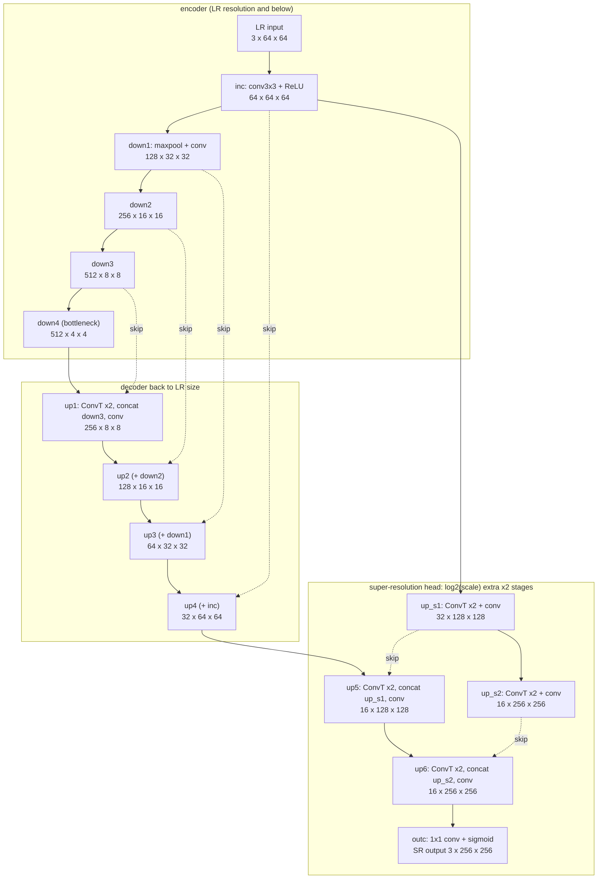
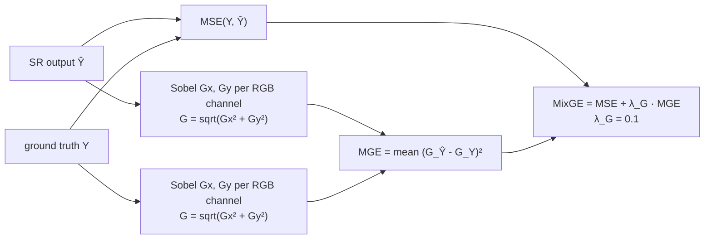
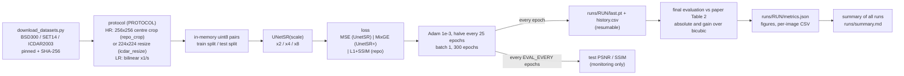

# PBL · Simplified U-Net super-resolution (UnetSR / UnetSR+)

This folder is a reproducible, single-notebook PyTorch re-implementation of

> Z. Lu and Y. Chen, **"Single Image Super Resolution based on a Modified U-net with Mixed Gradient Loss"**,
> arXiv:1911.09428 (2019); journal version in *Signal, Image and Video Processing* 16, 1143–1151 (2022).

It is built on this repository, a fork of the authors' code
[`Mnster00/simplifiedUnetSR`](https://github.com/Mnster00/simplifiedUnetSR) (the paper's footnote links it as
`github.com/MnisterLu/simplifiedUnetSR`).
Everything new lives in `PBL/`; the original code is not modified.

| file | what it is |
|---|---|
| [`SimplifiedUNetSR.ipynb`](SimplifiedUNetSR.ipynb) | **all of the code**: data pipeline, model, losses, metrics, training, evaluation against the paper, figures, inference |
| [`download_datasets.py`](download_datasets.py) | downloads BSD300, SET14 and ICDAR2003 into `PBL/data/` (Python standard library only) |
| [`dataset_manifest.json`](dataset_manifest.json) | pinned mirror commits and the SHA-256 of every image, used to verify downloads |
| [`pyproject.toml`](pyproject.toml), [`.python-version`](.python-version) | uv project: Python 3.12, PyTorch as `cpu` / `cu126` / `cu130` extras |
| [`requirements.txt`](requirements.txt) | the same dependencies for `pip` / `uv pip` |
| [`results/bicubic_calibration.csv`](results/bicubic_calibration.csv) | the needs-no-training protocol study behind §5 |
| [`results/set14_subset_search.csv`](results/set14_subset_search.csv) | which Set14 images form the paper's SET14 test set (§3) |
| [`GPU_SESSION.md`](GPU_SESSION.md) | checklist for the first run on a GPU machine: setup, tests and a 30-minute training run |
| [`results/sanity_x8_BSD300_40ep_*`](results/) | the two short training runs of §7 (config, per-epoch history, metrics, curves) |
| [`results/ablation_x8_BSD300_15ep_mixge_raw`](results/ablation_x8_BSD300_15ep_mixge_raw/) | the literal-Sobel MixGE run of the §2 ablation |

**Contents**
1. [Quick start](#1-quick-start-uv)
2. [The method](#2-the-method)
3. [Datasets](#3-datasets)
4. [Pipeline](#4-pipeline)
5. [Protocol and metrics](#5-pre-processing-and-evaluation-protocol)
6. [Training parameters](#6-training-parameters)
7. [Does it perform like the paper?](#7-does-it-perform-like-the-paper)
8. [Notes on the original code](#8-notes-on-the-original-code)
9. [Troubleshooting](#9-troubleshooting)
10. [Citation](#10-citation)

---

## 1 Quick start (uv)

Install [uv](https://docs.astral.sh/uv/getting-started/installation/), then run this from the repository root (it
works the same in Linux shells and Windows PowerShell):

```bash
cd PBL
uv sync --extra cu130                      # pick ONE extra: cu130 | cu126 | cpu  (table below)
uv run python -c "import torch; print(torch.__version__, torch.cuda.is_available(), torch.backends.mps.is_available())"
uv run python download_datasets.py         # BSD300 + SET14 + ICDAR2003 -> PBL/data/
uv run jupyter lab SimplifiedUNetSR.ipynb  # then: Run > Run All Cells
```

| your hardware | extra | requirement |
|---|---|---|
| NVIDIA Turing → Blackwell: RTX 20xx/30xx/40xx/50xx, A100, H100, B200, … | `cu130` | NVIDIA driver ≥ 580 (Linux 580.65, Windows 580.88); the only choice for RTX 50xx / B200 |
| NVIDIA Maxwell → Volta: GTX 9xx/10xx, Titan X/V, V100; or a Turing → Hopper GPU that must stay on driver 525–579 | `cu126` | driver ≥ 525.60 (Linux) / 528.33 (Windows); has no Blackwell kernels |
| no NVIDIA GPU (Linux, Windows) | `cpu` | none |
| macOS: Apple Silicon (M1 or newer), GPU used via MPS | `cpu` | macOS 14 Sonoma or newer; current PyTorch has no wheels for Intel Macs or macOS 13 |

> **uv does not remember extras.** Pass the same `--extra` to every `uv sync`; a plain `uv sync` removes PyTorch
> again. `uv run` leaves the environment alone. The first `uv sync` writes `uv.lock` (one lock file for all platforms
> and extras); this project does not commit it.

A working NVIDIA setup prints something like `2.14.1+cu130 True False`, an Apple-Silicon Mac `2.14.1 False True`. On
an NVIDIA machine, a `+cpu` version or `False` for CUDA means the wrong build or driver; see [§9](#9-troubleshooting).
Section 2 of the notebook prints a diagnosis and the fix.

**Headless and batch runs** use [papermill](https://papermill.readthedocs.io). Any variable in the notebook's first
code cell can be overridden with `-p NAME value` (booleans as `True` / `False`; `true` / `false` work too). Every
configuration gets its own folder `runs/<RUN_NAME>/`: the default name tags each setting you changed, e.g.
`BSD300_x4_mixge_lg0.01`, so runs never overwrite each other.

```bash
uv run papermill SimplifiedUNetSR.ipynb runs/smoke.ipynb -p SMOKE_TEST True       # checks the pipeline in ~20 s
uv run papermill SimplifiedUNetSR.ipynb runs/BSD300_x4_mixge.ipynb -p SCALE 4 -p LOSS mixge
uv run papermill SimplifiedUNetSR.ipynb runs/calibrate.ipynb -p MODE calibrate    # protocol study, no training
```

**The pip / requirements.txt route**, if you prefer it:

```bash
uv venv --python 3.12
uv pip install -r requirements.txt --torch-backend=auto    # uv >= 0.9.4 picks the CUDA build for your driver
uv run --no-sync jupyter lab SimplifiedUNetSR.ipynb
```

With plain pip, run `pip install torch --index-url https://download.pytorch.org/whl/cu130` (or `cu126` / `cpu`) first,
then `pip install -r requirements.txt`.

> **What was tested where.** This folder was built in a CPU-only Linux sandbox that could reach GitHub and PyPI only.
>
> **Verified there:** the uv environment (PyPI's torch 2.14.1, a CUDA 13.0 build, running on CPU); the dataset download
> from the pinned GitHub mirrors; the notebook end to end on CPU (×2/×4/×8, all losses, resume, AMP, hold-out,
> `MODE=calibrate`); and the protocol study.
>
> **Not runnable there:** training on a GPU (the CUDA and MPS code paths, resume included, were reviewed but not run);
> the PyTorch CUDA wheels and the Windows/macOS setup, which need download.pytorch.org; the original
> Berkeley/HuggingFace hosts; and the ICDAR2003 servers, which are plain HTTP and are covered by fixture-based tests
> instead.

---

## 2 The method

### Modified U-net (paper §3.1, repo `Unet/Umodel.py`)

The paper changes the original U-net in three ways:

* All batch-norm layers and one of the two convolutions in each block are removed, so every block is a single 3×3
  conv + ReLU.
* The network takes the small LR image and **grows it**. After the usual encoder-decoder returns to the LR size, it
  adds `log2(scale)` extra ×2 stages: 1 for ×2, 2 for ×4, 3 for ×8. Their skip connections come from a chain of ×2
  transposed convolutions (`up_s1, up_s2, …`) applied to the first feature map.
* Depth 5 is the accuracy/cost trade-off the paper picks (Fig. 3).

The diagram shows the ×4 model with tensor sizes for a 64×64 input (`repo_crop` protocol):



| model | repo class | decoder up-sampling | extra ×2 stages | output | parameters |
|---|---|---|---|---|---|
| ×2 | `UNet2` | transposed conv 2×2 | 1 (width 32) | 1×1 conv, no activation | **8,495,907** (paper: 8.50 M) |
| ×4 | `UNet4` | transposed conv 2×2 | 2 (16, 16) | 1×1 conv + sigmoid | 8,501,043 |
| ×8 | `UNet8` | bilinear, `align_corners=True` | 3 (16, 8, 8) | 1×1 conv + sigmoid | 7,103,299 |

The notebook's `UNetSR(scale)` keeps the repository's module names. The original `UNet2/4/8` weights therefore load
with `strict=True` and give **bit-identical outputs**, which the notebook checks every time it runs.

### Mixed gradient error (paper §3.2)



* **UnetSR** is the modified U-net trained with MSE.
* **UnetSR+** is the same network trained with MixGE.
* The Sobel kernels are Gx = [[-1,-2,-1],[0,0,0],[1,2,1]] and Gy = [[-1,0,1],[-2,0,2],[-1,0,1]] (eqs. 2–3).
* λ<sub>G</sub> = 0.1 is the best value in the paper's sweep over 1e-4 … 1 (Fig. 4).

**One ambiguity matters a lot: how big the MGE term is.** The paper prints raw Sobel kernels and λ<sub>G</sub> = 0.1,
but also describes MSE as the *main* component and MGE as an *auxiliary* one. On the bicubic outputs of the 100
BSD300 test images, the two readings give:

* **raw kernels, taken literally**: 0.1·MGE is **2.5–3× the MSE**;
* **kernels ÷ 8**, the usual normalisation under which a ramp of slope 1 has a gradient of 1: 0.1·MGE is
  **0.04–0.05× the MSE**, an auxiliary term.

The notebook prints this ratio for your own run (section 7). The authors' unused `Unet/GraLoss.py` also scales its
gradient terms down, dividing them by 100 and 10 000. On the same images it comes to 0.3–0.4× the MSE, between the
two readings, so it does not decide the question.

A short ablation (×8, BSD300, 15 epochs, the same seed, CPU) decides it:

| loss | test PSNR / SSIM after 15 epochs | from |
|---|---|---|
| MSE | 21.17 dB / 0.510 | epoch 15 of [`results/sanity_x8_BSD300_40ep_mse`](results/sanity_x8_BSD300_40ep_mse/history.csv) |
| MixGE, raw Sobel kernels (literal, `SOBEL_NORM=False`) | 20.76 dB / 0.461 | [`results/ablation_x8_BSD300_15ep_mixge_raw`](results/ablation_x8_BSD300_15ep_mixge_raw/metrics.json) |
| **MixGE, Sobel ÷ 8 (default)** | **21.45 dB / 0.513** | epoch 15 of [`results/sanity_x8_BSD300_40ep_mixge`](results/sanity_x8_BSD300_40ep_mixge/history.csv) |
| (bicubic) | 21.34 dB / 0.495 | |

Only the normalised version reproduces the paper's finding that MixGE beats MSE (its Fig. 4). The notebook therefore
uses `SOBEL_NORM=True`; set `SOBEL_NORM=False` for the literal formula. On one CPU, training is deterministic: a
15-epoch run retraces the first 15 epochs of a 40-epoch run exactly.

Three smaller details the paper leaves open are fixed as follows:

* the Sobel filter runs on every RGB channel;
* valid convolution, i.e. no padding;
* ε = 1e-6 inside the square root, so gradients stay finite on flat regions.

---

## 3 Datasets

| dataset | content | split used here | paper |
|---|---|---|---|
| **BSD300** (BSDS300, Martin et al. 2001) | 300 natural photos, 481×321 | train 200 / test 100 (official split) | not stated; the bicubic match (§5) implies the official split |
| **SET14** (Zeyde et al. 2010) | 14 classic test images | train 11 / **test 3: comic, monarch, zebra** | not stated; inferred, see below |
| **ICDAR2003** Robust Reading (Lucas et al. 2003) | scene-text photos, 422×102 … 640×480 (paper §4.1) | train 258 / test 251 (official TrialTrain / TrialTest) | 258 / 249 |

**Why SET14 is split 11 / 3.** The paper never says how it used SET14. The repository's data code expects
`<dataset>/images/{train,test}` for *every* dataset, and its comments list `SET14/images`. The decisive evidence:
**the paper's SET14 bicubic numbers are reproduced to all four decimals, in PSNR and SSIM at ×2, ×4 and ×8, if and
only if the test set is `comic`, `monarch` and `zebra`.** `MODE=calibrate` checks all 16,383 subsets of the 14
images; the next best one, comic + zebra, is 0.35 dB / 0.052 SSIM off
([`results/set14_subset_search.csv`](results/set14_subset_search.csv)).
Which images the authors trained their SET14 models on is not known; the notebook assumes the other 11.

To score a model trained on another dataset (e.g. BSD300) on all 14 images, as most SR papers do, add `"SET14_ALL"` to
`EVAL_SETS`. For a SET14-trained model, SET14_ALL would include its 11 training images; the notebook warns about that.
`VAL_HOLDOUT = 50` sets aside 50 seeded training images as an extra test set `<DATASET>_VAL`, as the paper did for its
depth and λ<sub>G</sub> studies (§4.4.1); the files in `data/` are not touched.

### `download_datasets.py`

```bash
uv run python download_datasets.py                        # all three datasets
uv run python download_datasets.py --datasets bsd300 set14
uv run python download_datasets.py --verify-only          # re-count and re-hash what is in data/
uv run python download_datasets.py --list-sources         # show the source URLs, in the order they are tried
```

It needs only the Python standard library, so it also runs before `uv sync`. The notebook calls it automatically for
missing datasets. The resulting layout:

```
PBL/data/
├── BSD300/{train,test}/*.jpg        200 / 100
├── SET14/{train,test}/*.png         11 / 3
├── ICDAR2003/{train,test}/*.jpg     258 / 251
└── PROVENANCE.json                  source, URL, time, checksums and licence note per dataset
```

| dataset | sources, tried in order | verification |
|---|---|---|
| BSD300 | 1. Berkeley `BSDS300-images.tgz` (HTTPS, then HTTP) · 2. GitHub mirror `BUPTLdy/pytorch-lapsrn` @ `6948718` | SHA-256 of all 300 images + the official iids split lists |
| SET14 | 1. GitHub mirror `jbhuang0604/SelfExSR` @ `8f6dd8c` (`image_SRF_2` HR images) · 2. HuggingFace `eugenesiow/Set14` | SHA-256 of all 14 images (mirror) |
| ICDAR2003 | 1. IAPR-TC11 `TrialTrain/scene.zip`, `TrialTest/scene.zip` · 2. Essex `algoval` copy | SHA-256 of both zips (the values docTR uses) |

Notes:

* The GitHub mirrors are pinned to a commit, and every file is hash-checked.
* The SelfExSR copies of comic, ppt3 and zebra have at most one pixel row or column trimmed so that sizes are even.
  These exact files reproduce the paper's SET14 bicubic row to the fourth decimal.
* **ICDAR2003 is only served over plain HTTP.** If your network blocks that, download the two zips by hand. Both are
  called `scene.zip`, so save `TrialTrain/scene.zip` as `PBL/data/.downloads/icdar2003_train.zip` and
  `TrialTest/scene.zip` as `PBL/data/.downloads/icdar2003_test.zip`, then re-run the script. When the download fails,
  the script prints both URLs with these target paths and their SHA-256; `--list-sources` shows them too. (With
  another `--root` or `DATA_DIR`, use its `.downloads/` folder.)
* The same works for the other datasets: `.downloads/BSDS300-images.tgz` and `.downloads/Set14_HR.tar.gz` are used
  before any download is tried.
* **Licences.**
  * BSDS300 is free for non-commercial research and education.
  * Set14 and ICDAR2003 are research benchmarks.
  * Nothing from the datasets is committed to this repository.

---

## 4 Pipeline



---

## 5 Pre-processing and evaluation protocol

### The paper's text versus what reproduces its numbers

The paper's text (§4.3, Table 1) says every image is resized to 224×224 and downscaled with **bicubic** interpolation.
The bicubic baseline needs no training, so it is a direct test of that claim: under the same preparation, it must
reproduce the paper's "Bicubic" rows. Running the notebook with `MODE=calibrate` tries 8 variants on every available
dataset (`results/bicubic_calibration.csv`):

| protocol (notebook name) | HR ground truth | LR input | SET14 (3 test images) Δ vs paper, ×2 / ×4 / ×8 | BSD300 Δ vs paper, ×2 / ×4 / ×8 |
|---|---|---|---|---|
| **`repo_crop`** (PyTorch SR example) | central 256×256 crop, zero-padded if smaller | **bilinear** ↓s | **+0.0000 / −0.0000 / −0.0000 dB**, SSIM ±0.0000 | **+0.028 / +0.035 / +0.030 dB**, SSIM +0.001…0.002 |
| `icdar_resize` | whole photo → 224×224 bicubic | bilinear ↓s | −0.89 / −0.17 / +1.31 dB | +0.72 / +0.55 / +0.37 dB |
| `paper_text` (as written) | whole photo → 224×224 bicubic | **bicubic** ↓s | +0.36 / +0.25 / +1.52 dB | +1.63 / +0.98 / +0.68 dB |

**Conclusion.** The paper's BSD300 and SET14 numbers come from the pipeline of the PyTorch super-resolution example
that the repository's `dataset/data.py` is derived from: `CenterCrop(256)`, then `Resize(256//s)`, whose default filter
is bilinear. (The committed `data.py` has the `CenterCrop` lines commented out, see §8.) The numbers do not come from
the 224-pixel bicubic resize described in the text, which probably refers only to how the ICDAR2003 photos were
prepared (§4.1).

The notebook therefore defaults to `PROTOCOL="repo_crop"` for BSD300 and SET14. For ICDAR2003 it uses
`icdar_resize`: a 224×224 bicubic resize as in §4.1, plus the loader's bilinear LR. With `PROTOCOL="auto"` (the
default) every dataset, including extra test sets in `EVAL_SETS`, gets its own protocol. ICDAR2003 could not be downloaded
in the build sandbox, so that choice is **unverified**. Running `-p MODE calibrate` once the data is present shows
which variant reproduces the paper's ICDAR2003 bicubic row.

### Metrics (paper §4.2)

* **PSNR** = 10·log10(255²/MSE) on the RGB image (equivalently 10·log10(1/MSE) on [0,1] tensors), computed per image
  and then averaged over the test set.
* **SSIM** uses an 11×11 Gaussian window with σ = 1.5 and zero "same" padding, averaged over the channels. It is
  identical (|Δ| = 0) to the repository's `pytorch_ssim`; the notebook asserts this.
* Model outputs are **not** clamped before scoring, as in the repo. Only the ×2 model has an unbounded output.
* For reference, `metrics.json` also has the usual literature metrics: Y channel (BT.601), 8-bit, `scale` border
  pixels shaved, valid-window SSIM. These are *not* comparable with the paper.

---

## 6 Training parameters

| | paper (text) | repository code | **notebook default** |
|---|---|---|---|
| training data | not stated (one model per dataset is implied) | `<dataset>/images/train` | `DATASET` = BSD300 (or SET14, ICDAR2003); one model per dataset |
| HR / LR | 224×224, bicubic (Table 1) | `Resize(256)` / `Resize(256//s)` of the whole photo (`CenterCrop` commented out, §8) | `repo_crop`; `icdar_resize` for ICDAR2003 (§5) |
| batch size | 1 | 1 | 1 |
| optimiser | Adam β=(0.9, 0.999), ε=1e-8 | Adam, weight decay 1e-6 | Adam β=(0.9, 0.999), ε=1e-8, wd 1e-6 |
| learning rate | 1e-3, halved every 25 epochs | 1e-3 (`argdemo.txt`); MultiStepLR at 50/100/150/200 | 1e-3, `StepLR(25, 0.5)` |
| epochs | not stated | `-n 300` in the README example | 300 |
| loss | MSE (UnetSR), MixGE with λ<sub>G</sub> = 0.1 (UnetSR+) | L1 + 0.1·(1 − SSIM) | `LOSS="mixge"` (`"mse"`, `"l1_ssim"`) |
| Sobel scale in MGE | raw ±1/±2 kernels printed; MGE described as "auxiliary" | `GraLoss` divides by 100 and 10 000 (unused) | kernels ÷ 8 (`SOBEL_NORM=True`), see §2 |
| initialisation | not stated | PyTorch default (`weight_init` is a no-op) | PyTorch default |
| augmentation | not stated | none | none (`AUGMENT=True` optional) |
| hold-out set | 50 random training images, for the depth and λ<sub>G</sub> studies (§4.4.1) | none | none (`VAL_HOLDOUT=50` optional) |
| seed | not stated | 123 (set *after* the model is built) | 123, set *before* the model is built |
| model selection | not stated | last epoch | last epoch (test monitoring every `EVAL_EVERY` epochs) |
| run folder | – | – | `runs/<RUN_NAME>/`, one per configuration; resuming checks every training setting |
| hardware | 1× RTX 2080, PyTorch | PyTorch 1.x (2019) | any CUDA GPU, MPS or CPU; optional bf16 `AMP` |

---

## 7 Does it perform like the paper?

**Short answer:**

* Everything that can be checked without full training matches the paper: the architecture, the parameter count, the
  metrics, and the data protocol for BSD300 and SET14. (ICDAR2003 could not be downloaded here, so its protocol is
  unchecked.)
* The one configuration trained here, ×8 on BSD300, is within the "matches" threshold after only **40 of the ~300
  epochs**. That ran on a 4-core CPU (≈ 25 min per run).
* The full grid (×2 / ×4 / ×8 on all three datasets, 300 epochs each) was not run in the build sandbox, which is
  CPU-only and was asked for a smoke test only. Each run is one papermill command on a GPU, and the notebook fills in
  the comparison automatically.

| check | result | evidence |
|---|---|---|
| architecture = authors' code | ✅ identical outputs to `UNet2/4/8` with the same weights (max \|Δ\| = 0) | notebook §4 |
| parameter count | ✅ 8,495,907 (×2) = paper's **8.50 M** (Table 3, Fig. 3) | notebook §4 |
| metric implementation | ✅ SSIM identical to the repo's `pytorch_ssim` (\|Δ\| = 0) | notebook §5 |
| data protocol (bicubic rows of Table 2) | ✅ SET14 **exact** at ×2/×4/×8; BSD300 within **0.035 dB / 0.0021 SSIM**; ⚠️ ICDAR2003 unverified | `results/bicubic_calibration.csv` |
| pipeline runs end to end | ✅ ×2/×4/×8 × {mse, mixge, l1_ssim}, AMP, augmentation, resume (≤ 1e-8 from an uninterrupted run), SET14/ICDAR paths | papermill smoke tests |
| learns, and approaches the paper | ✅ ×8 BSD300, 40 epochs on CPU: UnetSR+ **21.75 dB / 0.520**, UnetSR 21.74 / 0.520, against the paper's 22.04 / 0.524 and 21.99 / 0.523 (−0.29 / −0.24 dB) | table below, [`results/`](results/) |
| full grid at the repo's 300-epoch budget (the paper does not state its epochs) | ⏳ **not run here.** Run the commands below on a GPU | `runs/summary.md` |

**Measured here: ×8 on BSD300, 40 epochs**, default settings otherwise (`repo_crop`, batch 1, Adam 1e-3 halved at
epoch 25, seed 123), single run:

| model | PSNR / SSIM | gain over bicubic | paper (Table 2) | paper gain | verdict, absolute / gain |
|---|---|---|---|---|---|
| UnetSR+ (MixGE, Sobel ÷ 8) | 21.746 / 0.5201 | +0.40 dB | 22.0368 / 0.5235 | +0.73 dB | matches / close |
| UnetSR (MSE) | 21.742 / 0.5195 | +0.40 dB | 21.9865 / 0.5231 | +0.68 dB | matches / matches |
| bicubic (same pairs) | 21.342 / 0.4951 | — | 21.3115 / 0.4933 | — | — |

The test PSNR levelled off after epoch 30: UnetSR+ peaked at epoch 30 (21.767 dB) and UnetSR at epoch 35
(21.776 dB), with the learning rate still at 5e-4; see
[`results/sanity_x8_BSD300_40ep_mixge/curves.png`](results/sanity_x8_BSD300_40ep_mixge/curves.png). Whether the
remaining ~260 epochs, with their further learning-rate halvings, close the last 0.25–0.3 dB is untested. Both runs,
with their config, per-epoch history and `metrics.json`, are in [`results/`](results/). Re-run them with the commands
below. Expect the same numbers on a CPU, up to floating-point differences between machines; a GPU differs slightly
more.

```bash
uv run papermill SimplifiedUNetSR.ipynb runs/x8_mixge_40.ipynb -p SCALE 8 -p LOSS mixge -p EPOCHS 40 -p EVAL_EVERY 5
uv run papermill SimplifiedUNetSR.ipynb runs/x8_mse_40.ipynb -p SCALE 8 -p LOSS mse -p EPOCHS 40 -p EVAL_EVERY 5
```

**To finish the comparison**, run the following from `PBL/`. On a GPU, the notebook prints an ETA after the first
epoch.

```bash
# bash / zsh (Linux, macOS, WSL)
for s in 2 4 8; do for l in mse mixge; do for d in BSD300 SET14 ICDAR2003; do
  uv run papermill SimplifiedUNetSR.ipynb runs/${d}_x${s}_${l}.ipynb -p DATASET $d -p SCALE $s -p LOSS $l
done; done; done
uv run papermill SimplifiedUNetSR.ipynb runs/summary.ipynb -p MODE calibrate   # also writes the protocol study
```

```powershell
# Windows PowerShell
foreach ($s in 2,4,8) { foreach ($l in 'mse','mixge') { foreach ($d in 'BSD300','SET14','ICDAR2003') {
  uv run papermill SimplifiedUNetSR.ipynb "runs/${d}_x${s}_${l}.ipynb" -p DATASET $d -p SCALE $s -p LOSS $l } } }
uv run papermill SimplifiedUNetSR.ipynb runs/summary.ipynb -p MODE calibrate
```

Each run writes `runs/<name>/metrics.json` with the absolute difference to the paper and the **gain over bicubic**
compared with the paper's gain. Each comparison with the matching paper row gets a verdict with thresholds fixed in
advance (test sets of other datasets, `SET14_ALL` and the hold-out set are scored but get none):

* **matches**: |ΔPSNR| ≤ 0.3 dB and |ΔSSIM| ≤ 0.01;
* **close**: |ΔPSNR| ≤ 1 dB;
* **differs**: anything else.

Section 12 of the notebook collects all runs into `runs/summary.md`.

**The targets** (paper Table 2, PSNR dB / SSIM, RGB). The notebook contains all 33 rows, including the eight
baselines.

| dataset | scale | Bicubic | UnetSR (MSE) | UnetSR+ (MixGE) | best baseline |
|---|---|---|---|---|---|
| SET14 (3 imgs) | ×2 | 24.4523 / 0.8482 | 26.7241 / 0.8735 | 28.3965 / 0.9198 | VDSR 28.6617 / 0.9269 |
| SET14 | ×4 | 19.7167 / 0.6089 | 20.8891 / 0.6693 | 21.6825 / 0.7112 | DBPN 21.7657 / 0.7171 |
| SET14 | ×8 | 16.1132 / 0.3673 | 16.7001 / 0.4093 | **17.8289** / 0.4103 | VDSR 16.7994 / 0.4095 |
| BSD300 | ×2 | 26.6538 / 0.7924 | 29.4241 / 0.8813 | 29.8403 / 0.8816 | DBPN 29.8675 / 0.8834 |
| BSD300 | ×4 | 23.5053 / 0.6157 | 24.8332 / 0.6843 | 24.9522 / 0.6901 | DBPN 25.0644 / 0.6967 |
| BSD300 | ×8 | 21.3115 / 0.4933 | 21.9865 / 0.5231 | 22.0368 / 0.5235 | DBPN 22.0577 / 0.5229 |
| ICDAR2003 | ×2 | 32.9327 / 0.9028 | 35.7147 / 0.9388 | **37.3673** / 0.9675 | DBPN 36.2344 / 0.9401 |
| ICDAR2003 | ×4 | 28.1135 / 0.7875 | 29.3374 / 0.8202 | **31.8966** / 0.8898 | VDSR 30.5267 / 0.8321 |
| ICDAR2003 | ×8 | 24.3856 / 0.6831 | 25.7734 / 0.7106 | **28.2512** / 0.8101 | DBPN 26.3482 / 0.7196 |

**What to keep in mind when you compare:**

* **SET14 numbers are very noisy.** By our analysis they are means over only **3 test images**, from models that
  presumably learned from the other **11 images**. Some of the paper's own baselines (EDSR, FSRCNN, SRGAN at ×2) score *below* bicubic
  there.
* **BSD300 is the most reliable comparison.** The protocol is reproduced to 0.035 dB, and it has 100 test images. The
  paper's UnetSR → UnetSR+ gain on BSD300 is small (+0.42 / +0.12 / +0.05 dB at ×2/×4/×8), so a single run of each may
  not separate the two. The ×8 runs above are an example: they differ by 0.003 dB.
* **For ICDAR2003, check the protocol first.** Run `MODE=calibrate` when the data is there: the protocol is unverified,
  and the official test set has 251 images against the paper's 249.
* **The paper leaves several things unstated**: the number of epochs (300 is the repo's example), the random seed, how
  the baselines were trained, and whether results are from a single run. Differences of a few tenths of a dB are within
  what the paper lets anyone reproduce.

---

## 8 Notes on the original code

The repository is a 2019 fork of [`icpm/super-resolution`](https://github.com/icpm/super-resolution) with the authors'
`Unet/` package added. It does not run as published. Here is what the notebook does about each problem:

| issue in the original code | effect | notebook |
|---|---|---|
| the dataset folder `dataset/output2/images/{train,test}` was never published, and there is no download code | the code cannot run | `download_datasets.py` with a documented layout |
| `CenterCrop` is commented out in `dataset/data.py` | non-square photos give mismatched SR/HR shapes and crash | explicit, named protocols (§5) |
| `UNet.weight_init()` loops over the top-level blocks only | the conv layers keep PyTorch's default init | the same default init, documented |
| `Unet/solver.py` optimises L1 + 0.1·(1−SSIM) | not the paper's MSE / MixGE | all three losses available; MixGE is the default |
| `Unet/GraLoss.py` applies the 2nd Sobel to the *output* of the 1st, pads by 2, and uses arbitrary /100, /10000 scaling; it is computed but never used | not the paper's MGE | paper eqs. (2)–(6), with the Sobel kernels ÷ 8 by default (see §2) |
| `torch.manual_seed` is called *after* the model is built; `listdir` order is unsorted | runs are not reproducible | seed before the model, sorted file lists, resumable checkpoints |
| `scheduler.step(epoch)` (deprecated) with MultiStepLR 50/100/150/200 | differs from the paper's "halve every 25 epochs" | `StepLR(25, 0.5)` as in the paper |
| `torch.save(model)` pickles the whole module; `Unet/output.py` is broken (`self` at module level) | the checkpoints are not portable | `state_dict` checkpoints, safe with `weights_only=True` |
| the README lists `-t` / `-seed` flags that `main.py` does not define | misleading | not used |

---

## 9 Troubleshooting

| symptom | fix |
|---|---|
| `torch.__version__` ends in `+cpu` on a GPU machine (Windows PyPI wheels are CPU-only) | `uv sync --extra cu130`, or `cu126` for GTX 9xx/10xx / V100 |
| `torch.cuda.is_available()` is False with a `+cu130` build | your driver is older than 580: update it (required for RTX 50xx / Blackwell), or use `--extra cu126` on an older GPU |
| "no kernel image is available" / "sm_61 is not compatible" | a pre-Turing GPU on the cu130 build: use `--extra cu126`, the build family that still ships Maxwell–Volta kernels |
| "no kernel image is available" on an RTX 50xx / B200 (Blackwell) | the cu126 build has no Blackwell kernels: update the driver to ≥ 580 and use `--extra cu130` |
| macOS: `uv sync` reports that torch has no wheel for your platform | current PyTorch needs Apple Silicon and macOS 14 or newer; on an Intel Mac use Linux, Windows or a cloud notebook |
| `uv run` keeps re-installing / torch disappears | always pass the same `--extra` to `uv sync`; do not run a bare `uv sync` |
| `--torch-backend` errors / no `cu130` choice | `uv self update` (needs uv ≥ 0.9.4) |
| ICDAR2003 download fails ("HTTP" / timeout) | its servers are plain HTTP and often blocked: download `TrialTrain/scene.zip` and `TrialTest/scene.zip` by hand, save them as `PBL/data/.downloads/icdar2003_train.zip` and `icdar2003_test.zip` (the script prints the URLs, paths and SHA-256), and re-run |
| `FileNotFoundError: ... download_datasets.py` | start Jupyter / papermill from inside `PBL/` |
| which parameters can I pass with `-p`? | `uv run papermill --help-notebook SimplifiedUNetSR.ipynb` lists them with their defaults |
| papermill list parameters | pass text: `-p EVAL_SETS "BSD300,SET14_ALL"` |
| papermill prints `Kernel is running over TCP without encryption` | harmless: the notebook's kernel only listens on `127.0.0.1` (your own machine) |
| training is slow on CPU | use `SMOKE_TEST=True` to check the pipeline; train on a GPU (batch 1, < 1 GB of VRAM) |
| interrupted run | re-run the same command: `RESUME=True` continues from `runs/<RUN_NAME>/last.pt`, on any device |
| `RuntimeError: runs/<name>/last.pt was trained with other settings` | a run folder holds one configuration only: leave `RUN_NAME` at `None` (the default name encodes the settings), pick another name, or set `RESUME=False` to start that folder from scratch |
| a parameter change seems to have no effect in Jupyter | restart the kernel and run all cells; cells that ran earlier keep the old values |

---

## 10 Citation

```bibtex
@article{lu2022unetsr,
  title   = {Single image super-resolution based on a modified U-net with mixed gradient loss},
  author  = {Lu, Zhengyang and Chen, Ying},
  journal = {Signal, Image and Video Processing},
  volume  = {16},
  pages   = {1143--1151},
  year    = {2022},
  note    = {arXiv:1911.09428}
}
```
