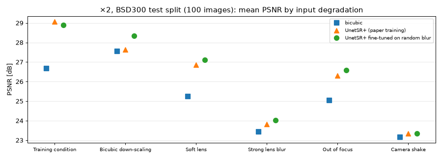
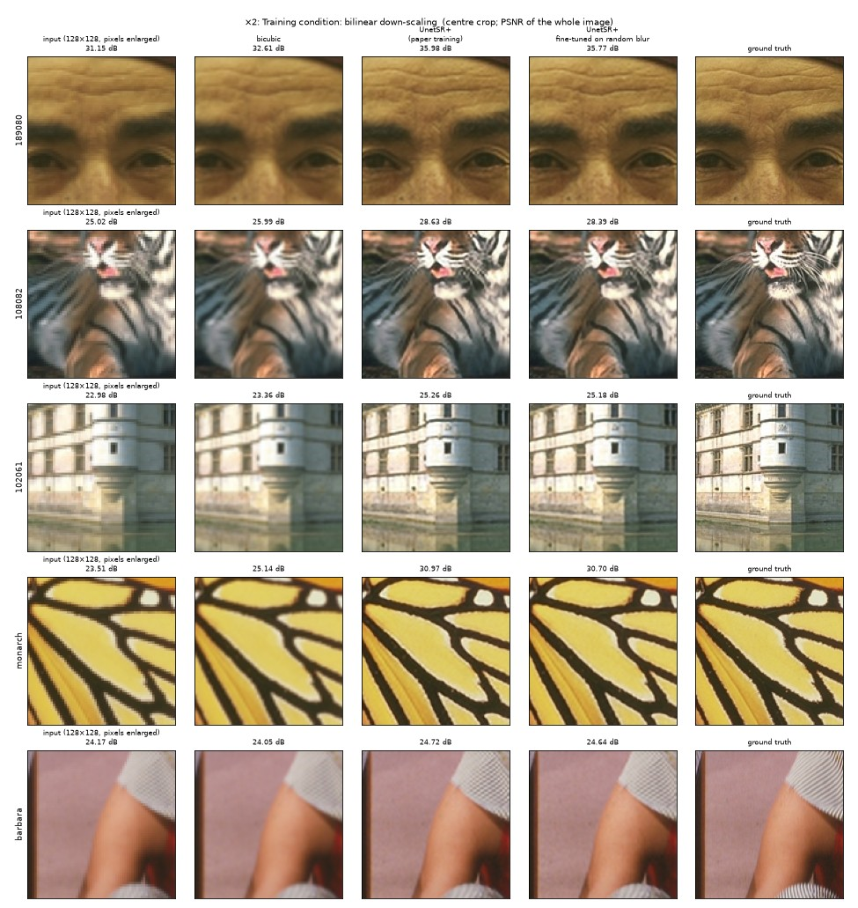
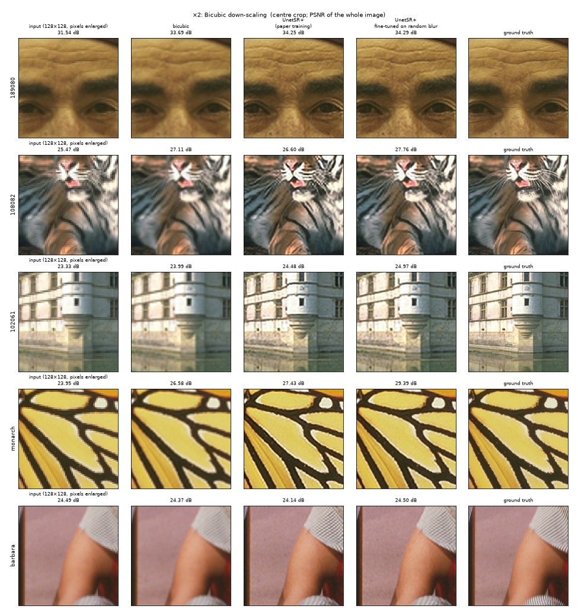
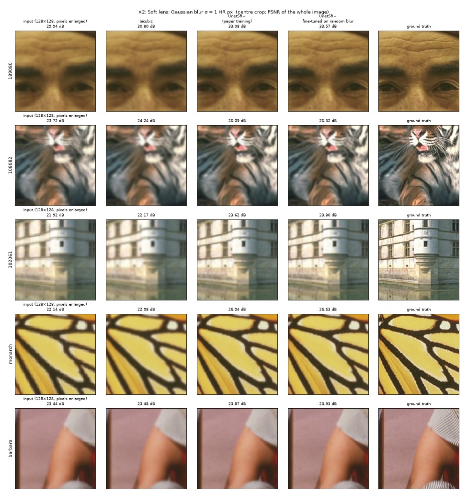
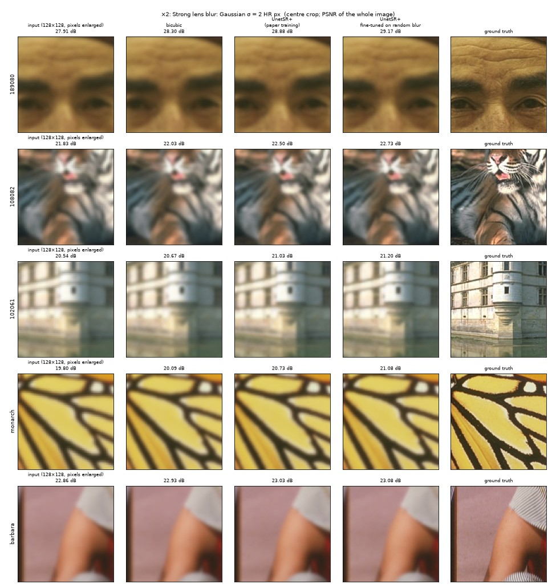

# ×2 super-resolution on realistically blurred images

> Generated by [`blur_showcase.py`](../blur_showcase.py) from the trained ×2 models; re-run it to refresh. **No image here was used for training**: the models learned from the 200 BSD300 training images only.

The models in the main results were trained and tested on one kind of input: a photo shrunk with a bilinear filter. Real photos are blurred in other ways too: by the lens, by a missed focus, by a shaking hand, or by another resize filter. This page shows what the ×2 model does with such inputs.

**What is compared** (each image: 256×256 ground truth → 128×128 input → 256×256 output):

* **bicubic**: plain bicubic enlargement, the baseline;
* **UnetSR+ (paper training)**: the 300-epoch UnetSR+ model trained as in the paper (`runs/BSD300_x2_mixge`);
* **UnetSR+ fine-tuned on random blur**: the same model after 100 more epochs with a random Gaussian blur (σ ≤ 0.5 LR px = 1 HR px) and a random bilinear / bicubic / box down-scaling (`runs/BSD300_x2_mixge_rand_ft_lr0.0001`).

Scores are mean PSNR in dB (higher is better) with SSIM in brackets, on RGB, as in the paper (README §5).

## Summary



**BSD300 test split (100 images)**

| input degradation | bicubic | UnetSR+ (paper training) | UnetSR+ fine-tuned on random blur | fine-tuning gain |
|---|---|---|---|---|
| Training condition: bilinear down-scaling | 26.68 (0.794) | 29.06 (0.874) | 28.90 (0.870) | -0.15 dB |
| Bicubic down-scaling | 27.55 (0.830) | 27.65 (0.869) | 28.34 (0.872) | +0.70 dB |
| Soft lens: Gaussian blur σ = 1 HR px | 25.25 (0.722) | 26.87 (0.793) | 27.11 (0.804) | +0.24 dB |
| Strong lens blur: Gaussian σ = 2 HR px | 23.45 (0.616) | 23.83 (0.639) | 24.01 (0.648) | +0.18 dB |
| Out of focus: disk blur, radius 2 HR px | 25.04 (0.710) | 26.31 (0.768) | 26.59 (0.780) | +0.28 dB |
| Camera shake: diagonal motion blur, 7 HR px | 23.16 (0.604) | 23.35 (0.625) | 23.35 (0.625) | +0.00 dB |

**Set14 (all 14 images)**

| input degradation | bicubic | UnetSR+ (paper training) | UnetSR+ fine-tuned on random blur | fine-tuning gain |
|---|---|---|---|---|
| Training condition: bilinear down-scaling | 27.11 (0.814) | 29.71 (0.872) | 29.57 (0.869) | -0.14 dB |
| Bicubic down-scaling | 28.15 (0.846) | 28.00 (0.862) | 28.71 (0.866) | +0.71 dB |
| Soft lens: Gaussian blur σ = 1 HR px | 25.46 (0.749) | 27.29 (0.809) | 27.57 (0.817) | +0.29 dB |
| Strong lens blur: Gaussian σ = 2 HR px | 23.31 (0.641) | 23.76 (0.664) | 23.97 (0.673) | +0.21 dB |
| Out of focus: disk blur, radius 2 HR px | 25.23 (0.737) | 26.72 (0.789) | 27.04 (0.799) | +0.32 dB |
| Camera shake: diagonal motion blur, 7 HR px | 22.86 (0.621) | 23.06 (0.636) | 23.07 (0.635) | +0.01 dB |

**What this shows** (BSD300 test split; Set14 agrees):

* **The paper model is tuned to one kind of input.** On its training condition it beats bicubic by 2.38 dB. On any other input that lead shrinks:
  * 1.61 dB with a soft lens and 1.27 dB out of focus;
  * 0.38 dB with strong lens blur and 0.20 dB with camera shake;
  * only 0.10 dB on a bicubic-shrunk input. That input is *sharper* than the training input, so the network, which learned to undo bilinear blur, over-sharpens it (§2: the tiger's whiskers, the butterfly's edges).
* **Fine-tuning on random blur removes the resize mismatch and helps with round blur.**
  * +0.70 dB on bicubic down-scaling (bicubic was one of its random filters);
  * +0.24 / +0.18 dB on soft / strong Gaussian blur;
  * +0.28 dB on the disk blur, which it never saw.
  * It costs 0.15 dB on the training condition.
* **Camera shake is not helped** (+0.00 dB). The fine-tuning only saw round (isotropic) blur, while motion blur has a direction. Training with directional kernels, as SRMD and BSRGAN do, is the next step.
* **Strong blur stays strong.** With strong lens blur or camera shake, even the better model is only 0.56 dB or less above bicubic. The blur has removed detail that ×2 super-resolution cannot invent.

Each section below shows five test images: three from BSD300 (a portrait, a tiger, a château) and two from Set14 (a butterfly, a patterned scarf). The panels show the centre of each image enlarged, so the detail is visible; the dB values are for the whole image.

## 1 Training condition: bilinear down-scaling

Exactly how the training inputs were made (the paper's protocol). The reference point.

BSD300 mean: bicubic 26.68 dB, paper model 29.06 dB, fine-tuned 28.90 dB.



## 2 Bicubic down-scaling

The standard benchmark degradation ("BI"). Bicubic is sharper than bilinear, so the input carries a little more detail than in training. The paper model, which learned to undo bilinear blur, over-sharpens it: see the halos on the tiger's whiskers and the butterfly's edges.

BSD300 mean: bicubic 27.55 dB, paper model 27.65 dB, fine-tuned 28.34 dB.



## 3 Soft lens: Gaussian blur σ = 1 HR px

A slightly soft lens or mild over-sharpening loss. At ×2 this is σ = 0.5 LR px, the edge of the fine-tuning range.

BSD300 mean: bicubic 25.25 dB, paper model 26.87 dB, fine-tuned 27.11 dB.



## 4 Strong lens blur: Gaussian σ = 2 HR px

A clearly soft photo. σ = 1 LR px, twice the fine-tuning range.

BSD300 mean: bicubic 23.45 dB, paper model 23.83 dB, fine-tuned 24.01 dB.



## 5 Out of focus: disk blur, radius 2 HR px

A camera focused slightly wrong. A disk kernel, a shape that neither model saw during training.

BSD300 mean: bicubic 25.04 dB, paper model 26.31 dB, fine-tuned 26.59 dB.


## 6 Camera shake: diagonal motion blur, 7 HR px

A hand-held shot with a slow shutter. Direction-dependent blur, which neither model saw during training.

BSD300 mean: bicubic 23.16 dB, paper model 23.35 dB, fine-tuned 23.35 dB.


## Reproduce

From `PBL/`, after the ×2 runs of README §7.4 exist (about 30 s on a GPU):

```bash
uv run python blur_showcase.py
```
